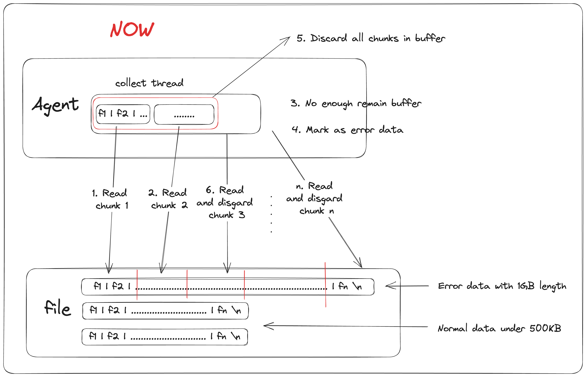
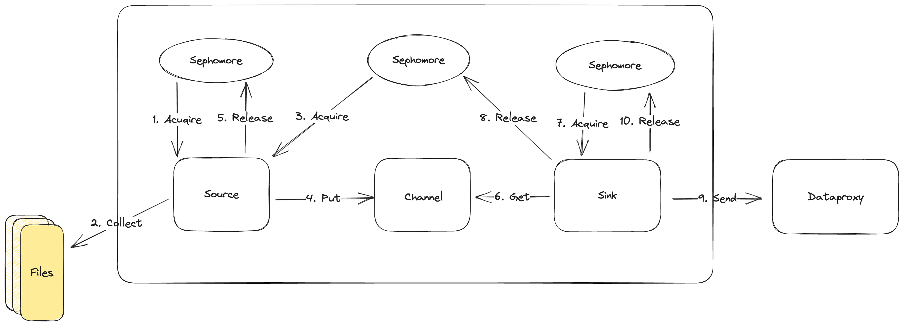
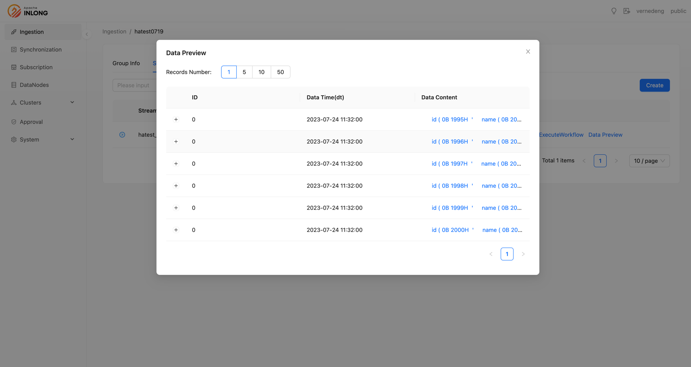
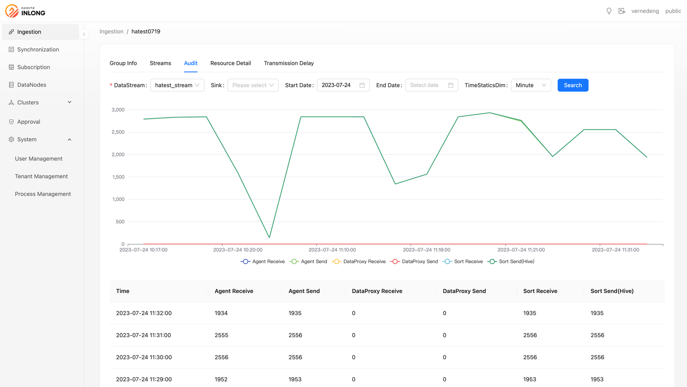

Apache InLong recently released version 1.8.0, which closed about 190+ issues, including 6+ major features and 30+ optimizations. The main improvements include multi-tenant management, support for multiple Apache Flink versions, data synchronization in Dashboard, data preview support, and optimization of ultra-long log processing logic. After the release of 1.8.0, Apache InLong has completed the layout of full-scenario data integration around data access, data synchronization, and data subscription, combined with multi-tenant management, multi-cluster management, approval flow management, and full-link audit/metrics.
<!--truncate-->

## About Apache InLong
As the industry's first one-stop, full-scenario, open-source massive data integration framework, Apache InLong provides automatic, safe, reliable, and high-performance data transmission capabilities to facilitate businesses to build stream-based data analysis, modeling, and applications quickly. At present, InLong is widely used in various industries such as advertising, payment, social networking, games, artificial intelligence, etc., serving thousands of businesses, among which the scale of high-performance scene data exceeds 1 trillion lines per day, and the scale of high-reliability scene data exceeds 10 trillion lines per day.

The core keywords of InLong project positioning are "one-stop" and "massive data". For "one-stop", we hope to shield technical details, provide complete data integration and support services, and implement out-of-the-box; With its advantages, such as multi-cluster management, it can stably support larger-scale data volumes based on trillions of lines per day.

## Overview of version 1.8.0
Apache InLong recently released version 1.8.0, which closed about 190+ issues, including 6+ major features and 30+ optimizations, mainly completing multi-tenant management, support for multiple Apache Flink versions, data synchronization in Dashboard, data preview support, and optimization of ultra-long log processing logic. After the release of 1.8.0, Apache InLong has completed the layout of full-scenario data integration around data access, data synchronization, and data subscription, combined with multi-tenant management, multi-cluster management, approval flow management, and full-link audit/metrics. Apache InLong has built a comprehensive data integration solution, achieving out-of-the-box usability:

- Data access: Data access is the process of aggregating data from data sources to the same storage service for further data querying and analysis;
- Data synchronization: Data synchronization is the process of establishing consistency between data sources and target data storage, which can coordinate data over time;
- Data subscription: Data subscription provides subscribers with the data they are authorized to access;

In version 1.8.0 of Apache InLong, many other features have also been completed, mainly including:

### Agent module
- Optimized ultra-long log processing logic, improving file collection efficiency and stability
- Fixed the issue of thread leakage caused by task termination
- Adopted flow control to solve the OOM problem caused by file number growth

### DataProxy module
- Support for Golang SDK
- Support for configuring black and white lists based on full IP or CIDR format IP segments
- Support for configuring the maximum number of write retries
- Support for sending data to the default Topic when write fails
- Code refactoring, unified configuration acquisition method

### Sort module
- Enhanced DDL parsing capability, improving the stability of DDL-aware scenarios
- Support for multiple Flink versions
- Support for Decimal precision recognition in whole-library scenarios
- Hive supports whole-library migration, with the implementation consistent with MySQL whole-library migration
- Iceberg supports automatic column updates and column deletions, greatly enriching Schema change capabilities

### Manager module
- Support for Pulsar, TubeMQ data preview
- Support for dynamic configuration of audit data sources
- Support for querying audit delay information
- Support for multi-tenant management

### Dashboard module
- Support for data flow preview
- Support for viewing InLongGroup resource details
- Support for tenant management and tenant switching
- Support for data synchronization

### Others
- Remove conflicting Jsqlparser versions
- Upgrade Spring-Boot-Autoconfigure version to 2.6.15
- Upgrade the Snappy-Java version to 1.1.10.1
- Fix syntax errors in Workflow configuration files

## 1.8.0 Feature Introduction
### Agent optimizes ultra-long log processing logic, improving file collection efficiency and stability
In actual use, due to improper use by users or bugs in data production programs, occasionally, a single data length reaches MB or even GB level. For Agents deployed in low-profile environments, this type of data greatly affects the performance of sending. The lower version Agent reads this type of data directly into memory based on the newline character and then discards it, but is limited by the hardware configuration of the Agent deployment environment, a single ultra-long data is extremely likely to cause OOM exceptions. In version 1.8.0, Agent optimized the processing logic of ultra-long logs, ensuring that data loading does not exceed memory limits through segmented collection and segmented discarding. Thanks to @justinhuang's contribution, see INLONG-8180 for details.



### Agent adopts global flow control, solving the OOM problem caused by the growth of file numbers
In previous versions, each file was collected and sent by its thread. Although we limited the maximum collection buffer of each file, with the growth of user traffic, the increase in the number of files is inevitable, leading to the simultaneous collection of too many files, causing OOM exceptions due to memory overflow. InLong supports the feature of Agent configuring global flow control in version 1.8.0. With this feature, Agent can effectively avoid frequent OOM problems caused by the growth of file numbers or the use of small quota servers. Thanks to @justinhuang's contribution, see INLONG-8251 for details. If you need to use this feature, you can add the corresponding configuration in agent.properties.


### Support multiple Flink versions
As community users go deeper into using InLong, the scenarios InLong faces become more diverse and complex. To support the needs of users in different Flink environments, InLong has added support for multiple Flink versions in the current version. Users can choose the Flink version to start in the plugins/flink-sort-plugin.properties configuration file in InLong-Manager.

When changing the Flink version required to run the Sort component, you also need to replace the connectors in the InLong-Sort/connector directory with the corresponding version of the jar package. For details, see the InLong official website documentation. Thanks to @Emsnap, @GanfengTan, and @haifxu for their contributions to this capability.
```
# inLong-manager/plugins/flink-sort-plugin.properties

# Flink version, support [1.13|1.15]
flink.version=1.13
```

### Support multi-tenant management
To address the requirements for permission and resource isolation in multi-user scenarios, InLong introduces a multi-tenant architecture in the current version. The multi-tenant architecture ensures that data and permissions do not interfere with each other among different users within the same group of services. Thanks to @vernedeng and @bluewang for their contributions to this feature, see INLONG-7914 for feature details. The following is the core process:


Tenants are transparent to core logic developers. At the entrance of the request, tenant authentication is added, and requests without access to the tenant's permissions are directly rejected; before accessing the Database, the corresponding tenant filter conditions are added to ensure that the scope of data query and modification is limited within the tenant.

Users can create tenants and assign tenant roles on the Dashboard.


### Support real-time synchronization
The new version supports real-time data synchronization. The main difference between real-time synchronization and data access is that it does not require the support of intermediate MQ storage. The Sort component directly stores the source data, greatly enriching the user's usage scenarios.

As shown in the figure below, the Tab page adds a "Data Synchronization" label. After the user configures the basic Group information, they only need to enter the "Data Source" and "Data Target" information, and after submitting the task, the data can be synchronized in real-time.

Thanks to @fuwen11, @bluewang, @Emsnap, and @haifxu for their contributions to this feature.


### Support data preview
For businesses just accessing InLong, data preview can help users quickly confirm the accuracy of reported data and locate problems. In this version, the InLong front supports previewing users' real-time reported data. Thanks to @fuwen11 and @bluewang's contributions, users can choose data preview in the operation bar under the data stream after successfully creating a data stream and reporting data.


### Support querying transmission delay
Transmission delay is crucial for some real-time consumption scenarios. In this version, InLong audit supports frontend viewing of average transmission delay indicators. Thanks to @fuwen11 and @bluewang's contributions, users can query link transmission delay after successfully creating a data stream and reporting data.


## Follow-up planning
In version 1.8.0, the community also restructured the DataProxy code, unified the configuration pull interface, supported complete IP and CIDR-based IP segment configuration of black and white list features, and improved module performance and stability. Sort has improved stability in DDL sensing scenarios and supports whole library migration of Hive, Iceberg automatic column update, and column storage features. In subsequent versions, InLong will refactor DataProxy C++ SDK, enrich Flink 1.15 Connector, and improve data synchronization functions, looking forward to more developers participating in the contribution.