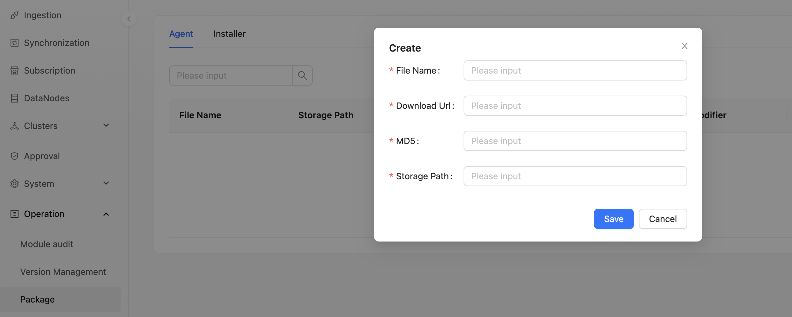
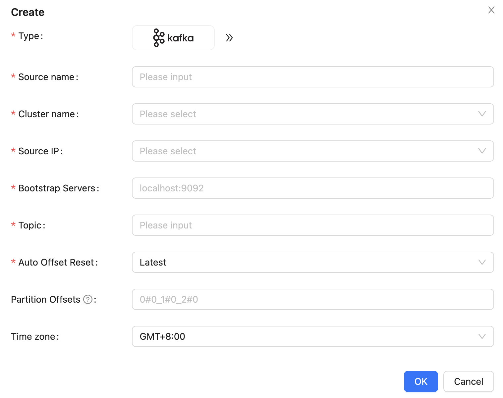
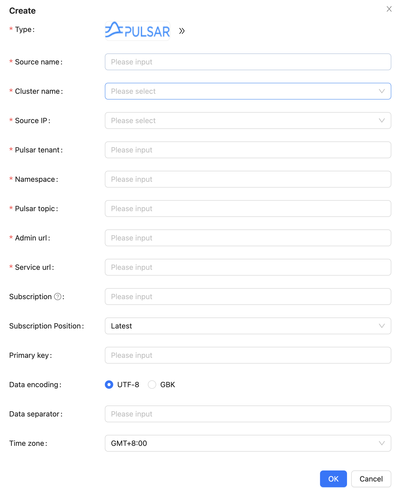
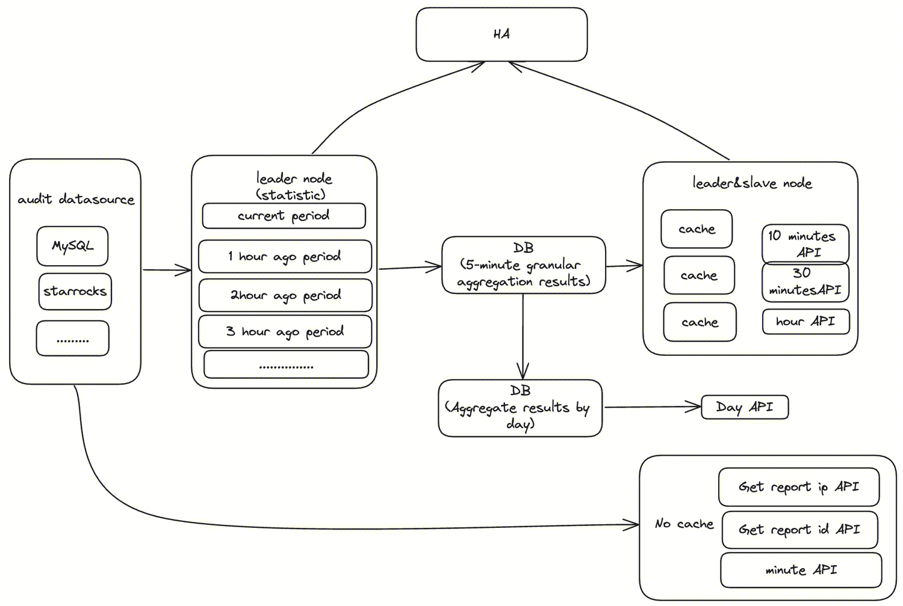
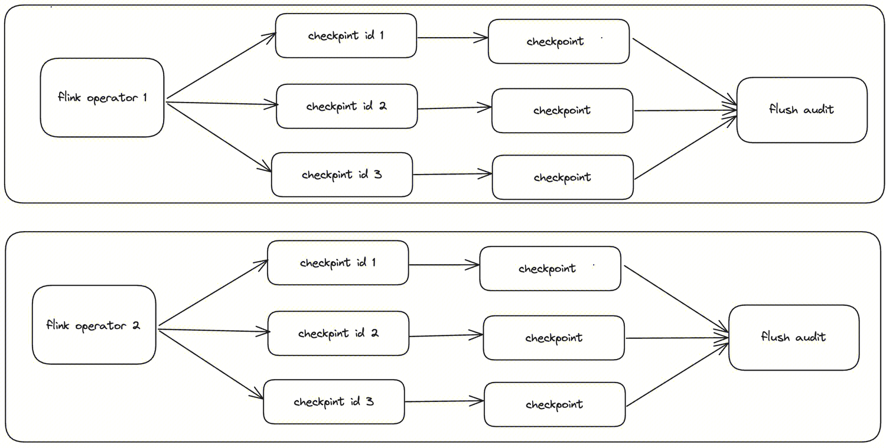

Apache InLong recently released version 1.12.0, which closed about 140+ issues, including 7+ major features and 90+ optimizations. The main features include Manager supports for agent install package management and it's self-upgrading processe, Agent ability for self-upgrading process, Agent ability for collecting data from Kafka、Pulsar and MongoDB, Support for Redis connector in Sort module, Optimization for Audit and enhancement of its capabilities
. After the release of 1.12.0, Apache InLong has enriched and optimized Agent function scenarios, enhanced the accuracy of Audit data measurement, and enriched the capabilities and applicable scenarios of Sort, solved the demand for quick troubleshooting in development and operation, and optimized the user experience of Apache InLong operation and maintenance.
<!--truncate-->

## About Apache InLong

As the industry's first one-stop, full-scenario, open-source massive data integration framework, Apache InLong provides automatic, safe, reliable, and high-performance data transmission capabilities to facilitate businesses to build stream-based data analysis, modeling, and applications quickly. At present, InLong is widely used in various industries such as advertising, payment, social networking, games, artificial intelligence, etc., serving thousands of businesses, among which the scale of high-performance scene data exceeds 1 trillion lines per day, and the scale of high-reliability scene data exceeds 10 trillion lines per day.

The core keywords of InLong project positioning are "one-stop" and "massive data". For "one-stop", we hope to shield technical details, provide complete data integration and support services, and implement out-of-the-box; With its advantages, such as multi-cluster management, it can stably support larger-scale data volumes based on trillions of lines per day.

## 1.12.0 Version Overview

Apache InLong recently released version 1.12.0, which closed about 140+ issues, including 7+ major features and 90+ optimizations. The main features include Manager supports for agent install package management and it's self-upgrading processe, Agent ability for self-upgrading process, Agent ability for collecting data from Kafka、Pulsar and MongoDB, Support for Redis connector in Sort module, Optimization for Audit and enhancement of its capabilities
. After the release of 1.12.0, Apache InLong has enriched and optimized Agent function scenarios, enhanced the accuracy of Audit data measurement, and enriched the capabilities and applicable scenarios of Sort, solved the demand for quick troubleshooting in development and operation, and optimized the user experience of Apache InLong operation and maintenance. In Apache InLong 1.12.0 version, a large number of other features have also been completed, mainly including:

### Agent Module
- Agent ability for self-upgrading process
- Optimize initialization logic to reduce IO usage
- Optimize message acknowledgment logic to reduce semaphore competition
- Increase auditing for sending exceptions and resending
- Optimize message recovery logic to avoid data loss caused by too many supplementary files

### Manager Module
- Add an agent installer module management for agent installation
- Support parsing specific field information based on data types such as CSV while previewing data
- Supports pulsar multi cluster while previewing data
- Supports returning header and specific field information while previewing data
- Support adding data and tasks for file collection
- Audit data query switches from jdbc to Audit OpenAPI.
- Support to set compression type in Pulsar DataNode 
- Provide OpenAPI for batch saving InLongGroup, InLongStream, and other information.
- Support to config Kafka data node

### Dashboard Module
- Optimize audit data query
- Optimize audit data display
- Support for underscore "_" in Sink field mapping
- Support paginated display of resource details
- Support MongoDB data source configuration

### Audit Module
- Support user-defined ways to obtain Audit proxy information
- Audit SDK supports reporting version numbers
- Audit SDK supports both singleton and non-singleton usage
- Audit SDK supports data reporting in Flink Checkpoint feature
- Audit Service supports HA (High Availability) capabilities
- Audit Service supports local caching and OpenAPI
- Audit Service supports multi-datasource

### Sort Module
- Supports using state key during StarRocks connector sinitialization
- Supports parsing KV and CSV data containing split symbols
- Using ZLIB as the default compression type for Pulsar Sink
- Pulsar Connector supports authentication configuration
- Pulsar Sink supports authentication configuration
- Redis Source supports String, Hash, and ZSet data types
- Redis Sink supports Bitmap, Hash, and String data types

## 1.12.0 Version Feature Introduction

### Manager supports for agent install package management and it's self-upgrading processe
In version 1.12.0, Operator can manage Agent installation packages through the Dashboard, including Agent installation, upgrade, heartbeat management, etc. Users can create/manage installation packages on the System Operation -> Installation Packages -> Agent page. Thanks to @haifxu and @fuweng11. For more information, please refer to: INLONG-9932.

### Agent ability for self-upgrading process
Agents can perform self-upgrades through a pre-deployed Installer.The Installer will obtain the upgrade configuration information from InLong Manager via IP and determine whether to proceed with the upgrade based on the configuration. The main process includes:
- ADD: Download the installation package -> Unzip the installation package -> Start the process
- DELETE: Stop the process -> Delete the installation files
- UPDATE: Download the installation package -> Stop the process -> Delete the installation files -> Unzip the installation package -> Start the process
Thanks to @justinwwhuang. For more information, please refer to: INLONG-9801.

### Agent ability for collecting data from Kafka
In version 1.12.0, Agent supports data collection from Kafka. When creating a data source, you can directly select Kafka and fill all relevant data source information to start using it. The parameters include:
- Data source name: Used to distinguish between different data sources
- Cluster name: The cluster of data source belongs
- Data source IP: The IP information of data source
- Bootstrap Servers: Kafka cluster address
- Pulsar namespace: Pulsar namespace
- Kafka topic: Kafka topic
- Automatic offset reset: Set offset strategy
- Partition offset: Set specific partition offset
Thanks to @justinwwhuang. For more information, please refer to: INLONG-9741.

### Agent ability for collecting data from Pulsar
In version 1.12.0, Agent supports data collection from Pulsar. When creating a data source, you can directly select Pulsar and fill all relevant data source information to start using it. The parameters include:
- Data source name: Used to distinguish between different data sources
- Cluster name: The cluster of data source belongs
- Data source IP: The IP information of data source
- Pulsar tenant: Pulsar tenant
- Pulsar namespace: Pulsar namespace
- Pulsar topic: Pulsar topic
- Pulsar admin url: Pulsar admin url
- Pulsar service url: Pulsar service url
Thanks to @justinwwhuang. For more information, please refer to: INLONG-9804.

### Agent ability for collecting data from MongoDB
In version 1.12.0, Agent supports data collection from MongoDB. When creating a data source, you can directly select MongoDB and fill all relevant data source information to start using it. The parameters include:
- Data source name: Used to distinguish between different data sources
- Cluster name: The cluster of data source belongs
- Data source IP: The IP information of data source
- Server host: MongoDB address
- Username: MongoDB username
- Password: MongoDB password
- Database name: MongoDB database name
- Collection name: MongoDB collection name
- Read mode: Optional "Full + Incremental" or "Incremental"
Thanks to @justinwwhuang. For more information, please refer to: INLONG-10006。.

### Optimization for Audit and enhancement of its capabilities
In version 1.12.0, InLong enhancement the Audit reconciliation scenarios, including support for Agent data supplementation scenarios, Sort on Flink Checkpoint scenarios, etc.
Thanks to @doleyzi. For more information, please refer to: INLONG-9904、INLONG-9926、INLONG-9928、INLONG-9957.
- Support OpenAPI capabilities
In version 1.12.0, Audit has supported the OpenAPI, and each OpenAPI can be elected as the leader through HA. The leader node is responsible for real-time and retroactive aggregation of audit data, and the aggregated results are saved in the DB. The slave node is responsible for caching the data in the DB to memory and providing services externally. The leader node also provides the same service.

- Support Agent data supplementation capabilities
In version 1.12.0, Audit supports the Agent data supplementation scenario by adding audit-version, which distinguishes the audit reconciliation for each supplementation.

- Support Sort Flink Checkpoint capabilities
In version 1.12.0, Audit supports the Sort Flink checkpoint scenario, ensuring that audit data is not lost or duplicated when the Flink job restarts or fails over.

### Support for Redis connector in Sort module 
In version 1.12.0, An additional Flink 1.15-based Redis connector implementation has been added, supporting read and write operations for String, Hash, ZSet, and Bitmap, four common data types in Redis clusters and standalone instances. Schema conversion is supported in the Redis connector, allowing users to specify a Schema that can be converted to different Redis data types. The specific Schema conversion logic is shown in the following figure. In the bitmap conversion logic in the figure below, field1 as the key for the bitmap, while filed2 and field4 as the position (index) in the Bitmap. filed3 and field5 represent the set values (0 or 1). For specifics, refer to the native Redis command SETBIT key index value.
Thanks to @XiaoYou201. For more information, please refer to: INLONG-9835、INLONG-8948 .
## Future plans
In version 1.12.0, the community refactored InLong Agent, InLong
Audit, enriched Flink 1.15 Connector and other functions. In subsequent versions, InLong will continue to enrich Flink 1.15 Connector, enhance Transform capabilities, support offline data integration, unify DataProxy data protocols, optimize Dashboard experience, etc. We look forward to more developers participating and contributing.

