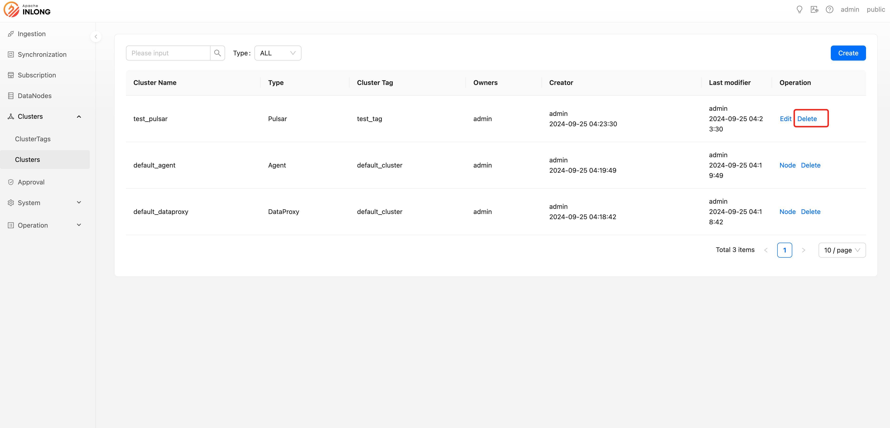

Only system administrators or tenant administrators have permission to use this feature, and they can create, modify, and delete clusters:

### Create cluster

Users with system administrator or tenant administrator permissions can create new clusters. When creating, you need to fill in the following information:

- Cluster Name：A user-defined name used to identify the cluster.
- Type：Cluster type.
- Cluster Tag：The cluster belongs to the cluster tag
- Owners：Specify the person responsible for the cluster, who is the only one able to modify the cluster's configuration information.
- Description：Provide a brief description of the cluster.
- 
The above are the basic configuration information for the cluster. Depending on the type of cluster, additional configuration information may be required. For example, for a Pulsar cluster, you may need to fill in the Service URL, AdminURL, default tenant, and token.

### Delete cluster

System administrators or tenant administrators have the right to delete created clusters. Once deleted, the cluster will no longer be available:

### Update cluster

System administrators or tenant administrators can modify created clusters. When modifying, you can change the basic configuration information of the cluster as well as any additional configuration information required based on the cluster type:

