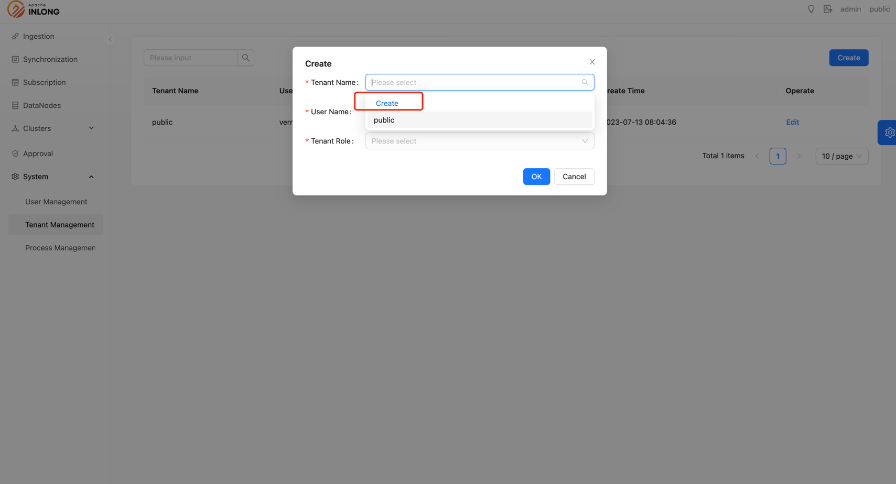

# Multi-tenant

For the implementation of InLong multi-tenant, please refer to:
https://github.com/apache/inlong/issues/7914

:::caution
- Resources and permissions are isolated between different tenants, and users can only see resources under their tenant.

- After upgrading from a lower version to version 1.8, all resources will be migrated to the `public` tenant.
:::

## Create a tenant
Currently, only **InLong Admins** are allowed to create and modify tenants.

- Select `Tenant Management`, and click `Create`.
  
- Choose to `Create` a new tenant.
  
- Complete the `Tenant Name` and description, click `OK` to finish creating the tenant.
  
  The tenant has been created at this point.

## Create tenant role

- Select `Tenant Management`, and click `Create`.
  
- Choose the target `Tenant Name`, `User Name`, and the `Tenant Role` you want to grant (if the tenant does not exist, please refer to [Create a tenant](#create-a-tenant)).
  
- After successful creation, you can see the tenants and their corresponding user roles in the `Tenant Management`.
  

## Tenant switching
- Click the `Tenant` field in the upper right corner and choose the tenant you switch to.
  