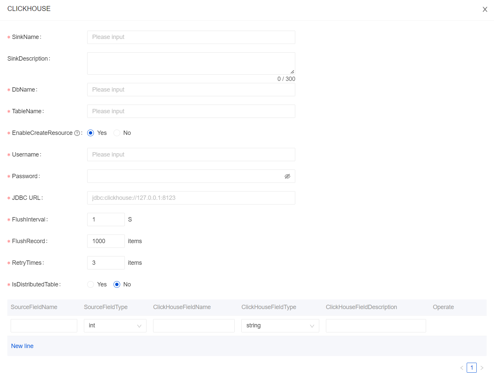

## Overview
[ClickHouse](https://clickhouse.com/docs/en/intro/)  is a column-oriented database management system (DBMS) for online analytical processing of queries (OLAP).
The ClickHouse load node support write data to ClickHouse. It doesn't support upsert. So it can't consume changelog stream.

## Configuration
When creating a data flow, select `ClickHouse` for the data stream direction, and click "Add" to configure it.



## Load node params

|  Option | Required  |  Default |  Type | Description  |
|---|---|---|---|---|
|id|required|(none)|String|Identifier for node|
|name|optional|(none)|String|Node name|
|fields|required|(none)|`List<FieldInfo>`|Table fields|
|fieldRelations|required|(none)|`List<FieldRelation>`|Defines the relation between fields from input to output field|
|properties|optional|(none)|Map<String, String>|This can set other properties for connector params|
|url|required|(none)|String|url rule is `jdbc:clickhouse://localhost:8123/database`|
|username|required|(none)|String|The value of ClickHouse username to connect|
|password|required|(none)|String|The value of ClickHouse password to connect|
|tableName|required|(none)|String|The name of ClickHouse table to connect|

## Dependency

We can find ClickHouse connector dependency `sort-connector-jdbc-1.2.0-incubating-SNAPSHOT.jar` after Inlong maven packaging.

## How to use in Flink SQL

```sql
CREATE TABLE `clickhouseTable`(
  `id` BIGINT,
  `name` STRING
) WITH (
  'connector' = 'jdbc-inlong',
  'dialect-impl' = 'org.apache.inlong.sort.jdbc.dialect.ClickHouseDialect',
  'url' = 'jdbc:clickhouse://localhost:8123/demo',
  'table-name' = 'ck_demo',
  'username' = 'default',
  'password' = ''
)
```