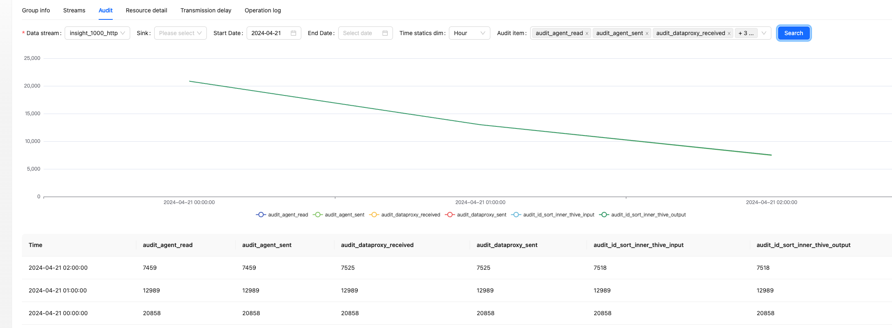

## Summary
In Standard Architecture, we can collect various types of data sources through the InLong Agent. The InLong Agent supports the extension of new collection types through plugins. This article will guide developers on how to customize the new Agent collection data source plugin.

## Concepts
### Task and Instance
Task and Instance are the two core concepts of Agent. Simple understanding: Task corresponds to a collection task configured on the management platform, while Instance is a specific collection instance generated by Task. For example, there is a collection task configuration on the management platform: `127.0.0.1 -> /data/log/YYMMDDhh.log._[0-9]+`, which means that the user needs to access the machine `127.0.0.1` collect data that conforms to the path rule `/data/log/YYMMDDhh.log._[0-9]+`. **This is a Task**. This Task will search for files that meet the conditions based on this path rule, and generate a corresponding Instance for each file that meets the conditions, for example, `/data/log/2024040221.log.0, /data/log /2024040221.log.1, /data/log/2024040221.log.3` 3 files, then the Task will generate 3 Instances to collect data from these three files respectively.


### Source and Sink
Source and Sink are lower-level concepts of Instance. They can be simply understood as each Instance has a Source and a Sink. As the name suggests, Source is used to read data from the data source; Sink is used to write data to the target storage.

## Development process (taking Pulsar as an example)
### Process
- Add Task: implement logic such as initialization, destruction, configuration verification, etc.
- Add Instance: implements logic such as node information setting.
- Add Source: implements logic such as initialization, destruction, data collection, and data provision.
- Add Sink: implement logic such as initialization, destruction, data input, data output (this article only focuses on new data sources, Sink will not be introduced, the default Sink is ProxySink)

### Add Task
Here we need to add a PulsarTask class to org.apache.inlong.agent.plugin.task.
```
public class PulsarTask extends AbstractTask {

    @Override
    public boolean isProfileValid(TaskProfile profile) {
        return false;
    }

    @Override
    protected void initTask() {

    }

    @Override
    protected List<InstanceProfile> getNewInstanceList() {
        return null;
    }
}
```
- initTask: initialization. For example, file collection can start folder monitoring during initialization.
- isProfilevalid: determine whether the task configuration is legal. The configuration of each type of task will have different restrictions, which can be implemented here.
- releaseTask: release task resources. For example, file collection can cancel folder monitoring here.
- getNewInstanceList: get a new instance. For example, when collecting files, it is found that there are new files that can be collected.

### Add Instance
Add the PulsarInstance class in `org.apache.inlong.agent.plugin.instance`. This class will be relatively idle because the main logic is in the CommonInstance base class. Its function is to create Source and Sink, read data from Source, and then write it to Sink. We only need to implement the setInodeInfo interface here. Except for FileInstance, which needs to set the Inode Info of the file, the other Instance classes only need to be set to empty strings.
```
public class PulsarInstance extends CommonInstance {

    @Override
    public void setInodeInfo(InstanceProfile profile) {
        profile.set(TaskConstants.INODE_INFO, "");
    }
}
```

### Add Source
Add the PulsarSource class to `org.apache.inlong.agent.plugin.sources:
```
public class PulsarSource extends AbstractSource {

    @Override
    public boolean sourceExist() {
        return false;
    }

    @Override
    protected void initSource(InstanceProfile profile) {

    }

    @Override
    protected void printCurrentState() {

    }

    @Override
    protected boolean doPrepareToRead() {
        return false;
    }

    @Override
    protected List<SourceData> readFromSource() {
        return null;
    }

    @Override
    protected String getThreadName() {
        return null;
    }

    @Override
    protected boolean isRunnable() {
        return false;
    }

    @Override
    protected void releaseSource() {

    }
}
```
- initSource: initialize the basic resource of this data source.
- sourceExist: returns whether the current data source exists, for example, whether the file was deleted during file collection.
- printCurrentState: prints the current collection status and is called regularly.
- doPrepareToRead: you can do some checks before reading data, such as whether the file is overwritten during file collection.
- readFromSource: actually reads data from the data source, such as consuming data from Kafka SDK and Pulsar SDK.
- getThreadName: get the worker thread name of the data source.
- isRunnable: returns whether this data source should continue.
- releaseSource: release the resources of the data source

## Task configuration
From the above, we can see that we have created new classes such as Task, Instance, Source, etc., and task configuration is to connect these classes together.
```
{
    "task.id": "74",
    "task.groupId": "test_group_pulsar",
    "task.streamId": "test_stream_pulsar",
    "task.source": "org.apache.inlong.agent.plugin.sources.PulsarSource",
    "task.sink": "org.apache.inlong.agent.plugin.sinks.ProxySink",
    "task.taskClass": "org.apache.inlong.agent.plugin.task.PulsarTask"
}
```
- task.source: Source class specified
- task.sink: Sink class specified
- task.taskClass: specifies the Task class

## Offset control
```
    protected class SourceData {

        private byte[] data;
        private Long offset;
    }
```
```
    protected List<SourceData> readFromSource() {
        return null;
    }
```
We can see that when the Source reads data, each piece of data will record its corresponding Offset. This Offset will be automatically recorded by the Agent after the Sink is successfully written.
When Source is initialized, its corresponding Offset will be automatically read and stored in the member variable offsetProfile of AbstractSource. You can use offsetProfile.getOffset() to
Get its Offset for initializing the data source.
```
	protected void initOffset() {
        offsetProfile = OffsetManager.getInstance().getOffset(taskId, instanceId);
    }
```

## Test
- **Audit Metrics Alignment**
It is required that the three indicators of Agent collection, Agent sending, and DataProxy receiving are completely aligned.
