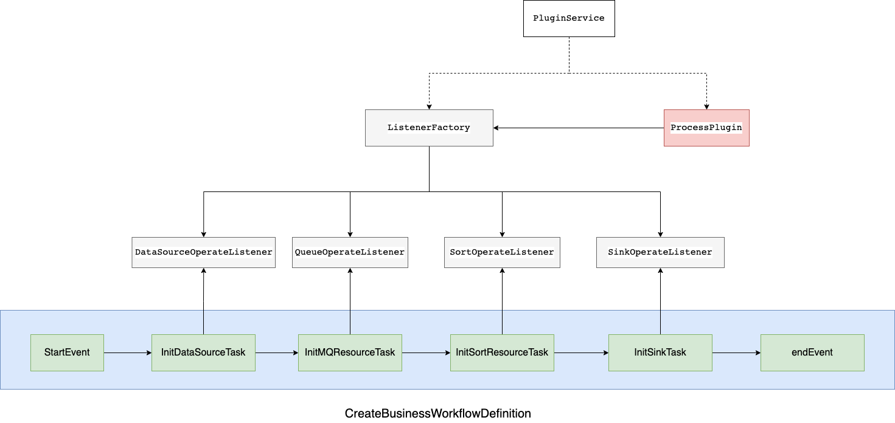

# Overview

This article is aimed at InLong-Manager plugin developers, trying to explain the process of developing an Manager plugin as comprehensively as possible, and strive to eliminate the confusion of developers and make plugin development easier.

## Before Development

- Inlong is stream processing framework constructed with a Group + Stream architecture. 
- An Inlong Group contains more than one Inlong Stream, each Inlong Stream is capable of a single individual dataflow.
- Inlong Group is responsible for physical resource definition shared by all Inlong Streams included, especially middleware clusters.
- In order to create Inlong Group, Inlong Manager use `CreateGroupWorkflowDefinition` to init all necessary physical resources, a workflow definition contains several individual service tasks. When it's created and processed, service tasks will be executed one after another. 
- Service task is constructed in **observer pattern**, which also known as the **publish-subscribe pattern**, each service task will register several task listeners. Listener accepts workflow context and controls execution logic on physical resources.
- As a developer, you need to develop specific Listener with personalized logic.

## Demonstration

- The Inlong Manager plugin mechanism can be represented by the following figure:


- When Inlong Manager is deployed, plugins must be located under installation directory, then **Manager Process** will find the plugin jar and install the plugin automatically.


- As a developer, you can confirm your plugin be loaded successfully by searching logs below:


## Reference Demo

- For helping all Inlong developers. We hava provide `manager-pluin-example` in Inlong Manager Module, which provide **EmptyProcessPlugin** as an example;

```java
public class EmptyProcessPlugin implements ProcessPlugin {

    @Override
    public Map<DataSourceOperateListener, EventSelector> createSourceOperateListeners() {
        return new LinkedHashMap<>();
    }

    @Override
    public Map<QueueOperateListener, EventSelector> createQueueOperateListeners() {
        return new LinkedHashMap<>();
    }

    @Override
    public Map<SortOperateListener, EventSelector> createSortOperateListeners() {
        return ProcessPlugin.super.createSortOperateListeners();
    }

    @Override
    public Map<SinkOperateListener, EventSelector> createSinkOperateListeners() {
        return ProcessPlugin.super.createSinkOperateListeners();
    }

}
```
- `DataSourceOperateListener`,`QueueOperateListener`,`SortOperateListener`,`SinkOperateListener` are child_classes extended from `TaskEventListener`. Then `EventSelector` decides whether the listener should be triggered. 
```java
public interface EventSelector {

    boolean accept(WorkflowContext context);

}
```
- After developing you plugin, you should prepare plugin definition file in **Yaml**, and put it under resources/META-INF.
```yaml
name: example
description: example for manager plugin
javaVersion: 1.8
pluginClass: org.apache.inlong.manager.plugin.EmptyProcessPlugin
```
- To develop available Listeners , you can refer to the native Listeners in `org.apache.inlong.manager.service.workflow.ServiceTaskListenerFactory`

## Last but not Least

We provide the plugin mechanism in Inlong Manager make it easier and more convenient for developers to customize personalized logic when Inlong is not supported.
Plugin mechanism is far from perfect now and we will continuously devote to improve it.