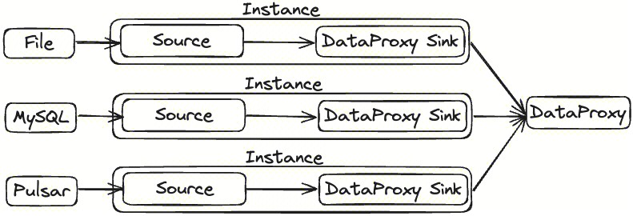
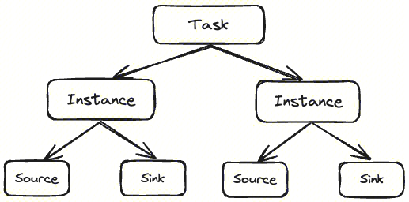
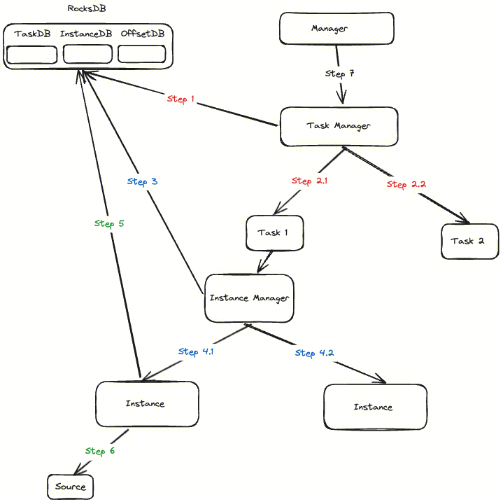
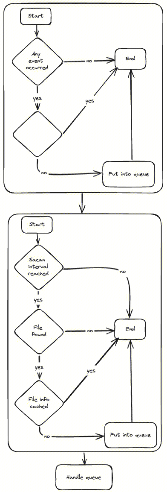

##Overview
The InLong Agent belongs to the collection layer of the InLong data link and is a collection tool that supports multiple types of data sources. It is committed to achieving stable and efficient data collection functions for various heterogeneous data sources, including File, MySQL, Pulsar, Metrics, etc.

###Overall architecture

The InLong Agent itself serves as a data collection framework. In order to facilitate the expansion of data sources, the data sources are abstracted as Source plugins and integrated into the entire framework.
-Source: Source is a data collection module responsible for collecting data from the data source.
-Agent configuration synchronization thread Manager Fetcher pulls from Manager to collection configuration
-Instance: Instance is used to retrieve data from the Source and write it to the DataProxy Sink

###Design concept
In order to address the issue of data source diversity, InLong Agent abstracts multiple data sources into a unified Source concept and abstracts a unified DataProxy Sink to write data into the InLong link. When a new data source needs to be connected, simply configure the format and reading parameters of the data source to achieve efficient reading.

###Basic concepts

####Tasks and instances
- Task
Collection tasks configured on behalf of users

- Instance
Instantiation of collection tasks, generated by Tasks, responsible for executing specific collection tasks

Taking file collection as an example, there is a collection task configuration on the Manager: ` 127.0.0.1->/data/log/YYYYMMDDhh. log_ [0-9]+'indicates that the user needs to collect data that meets the requirements of'/data/log/YYYYMMDDhh. log 'on the' 127.0.0.1 'machine_ The data for this path rule, [0-9]+, is a task. Assuming there are three files that meet this path rule:/data/log/202404021. log. 0,/data/log/202404021. log. 1,/data/log/202404021. log. 3, Task will generate three instances to collect these three files separately.

####Source and Sink
Source and Sink belong to the concept of the lower level of an instance. Each instance has a Source and a Sink, where the Source reads data from the data source and the Sink writes the data to the target storage. In the InLong system, data collected by the Agent will be uniformly written to the DataProxy service, which only has DataProxy Sink types.

##Implementation principle of InLong Agent
###Life cycle

Agent data collection tasks include configuration pulling, Task/Instance generation, Task/Instance execution, and other processes. Taking file collection as an example, the entire process of collection tasks includes:
- Step 1: Agent configuration synchronization thread Manager Fetcher pulls from Manager to collection configuration, such as Configuration 1 and Configuration 2
- Step 2: Synchronize thread to submit configuration to Task Manager
- Step 3.1/3.2: Task Manager will generate Task 1 and Task 2 based on Config1 and Config2
- Step 4: Task 1 scans files that comply with the rules of Configuration 1, such as File 1 and File 2, and submits the information of File 1 and File 2 to the instance manager, Instance Manger (where Instance Manager is a member variable of Task)
- Step 5.1/5.2: The Instance Manager generates corresponding instances based on the file information of File 1 and File 2, and runs them
- Step 6.1/6.2: The Source of each instance will collect file data based on the file information and send the collected data through Sink. After the file collection and transmission are completed, a signal indicating the completion of the instance will be sent to the instance manager, triggering the instance manager to release the instance
- Step 7: After detecting the completion of all instances through the Instance Manager, the Task Manager will send a signal to complete the Task, triggering the Task Manager to release the Task

###State saving
Agent data collection has a state, and in order to ensure the continuity of data collection, it is necessary to save the collected state to prevent the task from being unable to recover after the Agent stops unexpectedly. The Agent divides states into three categories: Task, Instance, and Offset, corresponding to Task task status, Instance instance status, and point status during the collection process, respectively. These three types of state data are saved through RocksDB and exist in three different DB directories.

The specified Source and Sink class names are saved in the InstanceDB record, as the class names may change after the Agent upgrade, such as the Source class changing from LogFileSource V1 to NewLogFileSource V1. At the same time, a task corresponds to multiple instances, and in order to avoid changes between different instances affecting each other, tasks and instances are also placed in different DBs. Place Offset in an independent DB to address the issue of using the old version's location information when upgrading the Agent.

###Data consistency
####Offset refresh mechanism
We adopt a similar "sliding window" algorithm: the Agent can send multiple pieces of data before stopping and waiting for confirmation. There is no need to stop and wait for confirmation for each piece of data sent, which ensures that the "offset is updated only after the ack is successful" and maintains a fast sending speed. Taking the collection of four pieces of data as an example:
- Firstly, Source sequentially reads 4 pieces of data from the data source

 
- Secondly, 4 pieces of data were retrieved from the Source`is sent in an orderly manner` Sink, when Sink receives the data `first records the offset of the data in the OffsetList and marks it as not sent`.

Then Sink sent 4 pieces of data through the SDK, but only 3 pieces of data, 1, 2, and 4, returned success. Returning success will `sets the corresponding identifier in OffsetList to true`

The offset update thread will traverse the OffsetList and find that Offset3 is not acked. Therefore, it will flush the closest Offset2 before Offset3 to the storage, ensuring that the data must be successfully sent downstream before performing the offset refresh.

####Restart recovery mechanism

As mentioned above, the status information of Task, Instance, and Offset is stored through RocksDB, and it can ensure that the data is successfully sent downstream before performing offset refreshing. The restart and recovery of collection tasks also depend on the saved state, and the entire process is as follows:
- Step 1: When starting, the Task Manager reads the TaskDB
- Step 2: Task Manager generates Task 1 and Task 2 based on the configuration of Task DB
- Step 3: Instance Manager reads InstanceDB
- Step 4: The Instance Manager generates an instance based on the records of the InstanceDB
- Step 5: Instance reads OffsetDB
- Step 6: Instance initializes the Source based on the OffsetDB configuration and restores the Offset
- Step 7: Regularly update tasks based on Manager configuration

##InLong Agent file collection mechanism
###Folder scanning
Scan all the files in the corresponding path and match the rules. Once matched, it is considered to be found. However, in the case of a large number of files, scanning once takes a long time and consumes resources. If the scanning cycle is too small, the resource consumption is too high; If the scanning cycle is too long, the response speed will be too slow.

###Folder listening
The above problem can be solved by listening to folders. We just need to register the folder to the listener, and then we can query whether any events have occurred through the interface of this listener. The types of listening events include adding, deleting, modifying, etc. Usually, we only need to listen for the addition of files, but it is easy to make too many modifications, while file deletion events can be actively detected during the process of reading files. But because listening events are triggered, consistency issues are prone to occur.

###Combining folder scanning and listening
In practical applications, we adopt a combination of folder scanning and monitoring mode. Simply put, for a folder, we perform both "scheduled scanning" and "monitoring" simultaneously, ensuring consistency and fast response speed. The specific process is as follows:
- Firstly, check from the file listener if there are any newly created files. If there are, check if they have been cached. If there is no cache, place them in the queue to be collected
- Secondly, if the scanning time interval is met, start scanning the file. If a file is scanned, check if it has been cached. If not, place it in the queue to be collected
- Finally, process the file information in the queue to be collected, which is to submit it to the Instance Manager

###File reading
We used the 'RandomAccess File' class to read files, and the instance of 'RandomAccess File' supports reading and writing to randomly accessed files. The behavior of randomly accessing files is similar to a large byte array stored in the file system. There is a cursor or index pointing to the implicit array, called a file pointer; Start reading bytes from the file pointer and move the file pointer forward as the byte is read. For example, the file has a total of 13 bytes, and we need to start reading 3 bytes from the offset of 4. We just need to point the file pointer to the offset of 4 and read 3 bytes.

##Conclusion
At present, the Agent already supports data sources such as files, Kafka, Pulsar, MongoDB, PostgreSQL, etc. In the future, it will continue to support more data sources, including Doris, Oracle, Redis, etc. At the same time, we will continue to do supplementary unit testing and other work to increase Agent robustness. Welcome everyone to work together!

