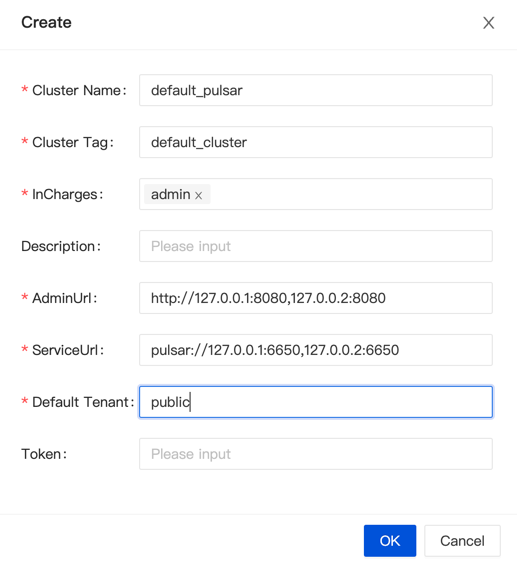
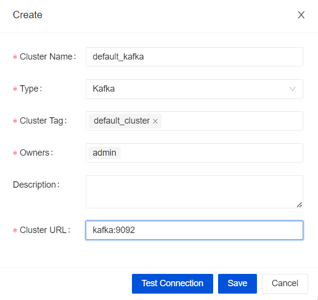

## Environment Requirements
- Install and start MySQL 5.7+
- initialize database
  there is `sql/apache_inlong_manager.sql` in `inlong-manager` directory, load this file through the
  following command to complete the initialization of the table structure and basic data

  ```shell
  # initialize database：
  mysql -uDB_USER -pDB_PASSWD < sql/apache_inlong_manager.sql
  ```

## Add Dependencies
- Download Sort [Connector Binary file](https://inlong.apache.org/download), and unzip it into `inlong-sort/connectors` directory.
- If using MySQL database, please download [mysql-connector-java-8.0.28.jar](https://repo1.maven.org/maven2/mysql/mysql-connector-java/8.0.28/mysql-connector-java-8.0.28.jar) and put it in the `lib/` directory.
- If you use PostgreSQL database, you don't need to download additional dependencies.

## Update Configuration
Go to the decompressed `inlong-manager` directory and modify the `conf/application.properties` file:
```properties
# manager service port number
server.port=8083

# The configuration file used is dev
spring.profiles.active=dev
```

The dev configuration is specified above, then modify the configurations in `conf/application-dev.properties` file:
```properties
# database configuration
spring.datasource.druid.url=jdbc:mysql://127.0.0.1:3306/apache_inlong_manager?useSSL=false&allowPublicKeyRetrieval=true&characterEncoding=UTF-8&nullCatalogMeansCurrent=true&serverTimezone=GMT%2b8
spring.datasource.druid.username=root
spring.datasource.druid.password=inlong
# Audit Proxy Address
metrics.audit.proxy.hosts=127.0.0.1:10081
```

:::note
If test or prod is specified, modify the corresponding application-test.properties or application-prod.properties file.
:::

## Configure the Flink Plugin
The InLong Manager can start the Sort task, you need to configure the Flink environment first. The configuration file is `plugins/flink-sort-plugin.properties`.
```properties
# Flink version, support [1.13|1.15]
flink.version=1.13
# Flink host split by coma if more than one host, such as 'host1,host2'
flink.rest.address=127.0.0.1
# Flink port
flink.rest.port=8081
# Flink job manager port
flink.jobmanager.port=6123
```

## Start Service
```shell
bash +x bin/startup.sh
```

## Cluster Initialize
When all containers are successfully started, you can access the Inlong dashboard address `http://localhost`, and use the following default account to log in:
```
User: admin
Password: inlong
```

### Create Cluster Tag
Click [Clusters]->[ClusterTags]->[Create] on the page to specify the cluster label name and person in charge:


:::caution
Since each component reports the ClusterTags as `default_cluster` by default, do not use other names.
:::

### Register MQ Cluster
You could only Register the MQ type you chose.

- Option 1: Register Pulsar Cluster
Click [Clusters]->[Clusters]->[Create] on the page to register Pulsar Cluster:


- Option 2: Register TubeMQ Cluster
Click [Clusters]->[Clusters]->[Create] on the page to register TubeMQ Cluster:


- Option 3: Register Kafka Cluster
Click [Clusters]->[Clusters]->[Create] on the page to register TubeMQ Cluster:


:::note
The ClusterTags selects the newly created `default_cluster`, and then configuring the MQ cluster info.
:::

## (Optional) Enable OpenAPI Authentication
### Enable Authentication
Manager supports the option to authenticate client component access to its open APIs. To enable authentication modify `conf/application.properties`：

```properties
# Manager open api authentication enabled
openapi.auth.enabled=true
```

### Authentication Configuration
Components that access manager must be authenticated by secret id and secret key if enabled, for example (please configure user's own instead of the example) :
- Modify `agent.properties` in agent's conf directory:
```properties
agent.manager.auth.secretId=admin
agent.manager.auth.secretKey=87haw3VYTPqK5fK0
```

- Modify `common.properties` in dataproxy's conf directory:
```properties
manager.auth.secretId=admin
manager.auth.secretKey=87haw3VYTPqK5fK0
```

### Authentication Key Generation
Admin user can log in InLong Dashboard to allocate secret ids and keys: **System->User->Create**.