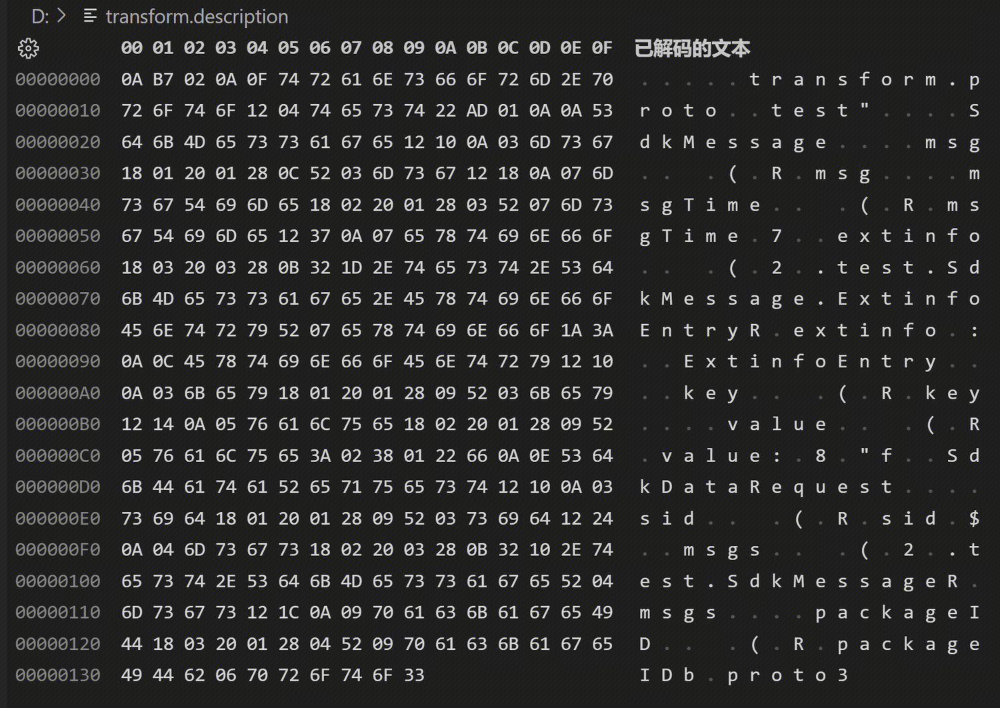

# Parameter Configuration Description
## TransformConfig Configuration Description
```java
public class TransformConfig {

    @JsonProperty("sourceInfo")
    private SourceInfo sourceInfo;	// Definition of data source decoding
    @JsonProperty("sinkInfo")
    private SinkInfo sinkInfo;		// Definition of data result encoding
    @JsonProperty("transformSql")
    private String transformSql;	//Data transformation SQL
}
```

## SourceInfo Configuration Description
### CSV
```java
    public CsvSourceInfo(
            @JsonProperty("charset") String charset,		// Character set
            @JsonProperty("delimiter") String delimiter,	// Delimiter
            @JsonProperty("escapeChar") String escapeChar,	// Escape character, if empty, no unescaping operation is performed during decoding
            @JsonProperty("fields") List<FieldInfo> fields)	// Field list, if empty, decode by default according to the delimiter, field names are assigned as $1, $2, $3... starting from 1;
                                                            // If the number of defined fields is less than the number of decoded fields, the extra fields will be discarded
      );
```

### KV
```java
    public KvSourceInfo(
            @JsonProperty("charset") String charset,		// Character set
            @JsonProperty("fields") List<FieldInfo> fields)	// Field list, if empty, decode by default using the Key in KV as the field name
                                                            // If the field name does not match the decoded field name, the field value will be empty, and extra field names will be discarded
      );
```

### ProtoBuffer
```java
    public PbSourceInfo(
            @JsonProperty("charset") String charset,					// Character set
            @JsonProperty("protoDescription") String protoDescription,	// Base64 encoded ProtoBuf protocol description
            @JsonProperty("rootMessageType") String rootMessageType,	// MessageType of the decoded source data, MessageType needs to be defined in the ProtoBuf protocol
            @JsonProperty("rowsNodePath") String rowsNodePath)			// Array node path of the ProtoBuf protocol containing multiple data to be converted
      );
```

#### Generate ProtoBuf Protocol Description
- Install Protocol Buffers compiler
```shell
PB_REL="https://github.com/protocolbuffers/protobuf/releases"
curl -LO $PB_REL/download/v3.15.8/protoc-3.15.8-linux-x86_64.zip
unzip protoc-3.15.8-linux-x86_64.zip -d $HOME/.local
export PATH="$HOME/.local/bin:$PATH"
protoc --version
#Displays libprotoc 3.15.8
```
- Parse the protocol to generate a Base64 encoded description
```shell
# transform.proto is the proto protocol file, transform.description is the binary description file after parsing the protocol
protoc --descriptor_set_out=transform.description ./transform.proto --proto_path=.
# Base64 encode the binary description file transform.description and write it to the file transform.base64, which is the parameter protoDescription in the configuration interface
base64 transform.description |tr -d '\n' > transform.base64
```
- Example of transform.proto
```ProtoBuf
syntax = "proto3";
package test;
message SdkMessage {
  bytes msg = 1;
  int64 msgTime = 2;
  map<string, string> extinfo = 3;
}
message SdkDataRequest {
  string sid = 1;
  repeated SdkMessage msgs = 2;
  uint64 packageID = 3;
}
```
- Example of transform.base64
```text
CrcCCg90cmFuc2Zvcm0ucHJvdG8SBHRlc3QirQEKClNka01lc3NhZ2USEAoDbXNnGAEgASgMUgNtc2cSGAoHbXNnVGltZRgCIAEoA1IHbXNnVGltZRI3CgdleHRpbmZvGAMgAygLMh0udGVzdC5TZGtNZXNzYWdlLkV4dGluZm9FbnRyeVIHZXh0aW5mbxo6CgxFeHRpbmZvRW50cnkSEAoDa2V5GAEgASgJUgNrZXkSFAoFdmFsdWUYAiABKAlSBXZhbHVlOgI4ASJmCg5TZGtEYXRhUmVxdWVzdBIQCgNzaWQYASABKAlSA3NpZBIkCgRtc2dzGAIgAygLMhAudGVzdC5TZGtNZXNzYWdlUgRtc2dzEhwKCXBhY2thZ2VJRBgDIAEoBFIJcGFja2FnZUlEYgZwcm90bzM=
```
- Example of transform.description


### Json
```java
    public JsonSourceInfo(
            @JsonProperty("charset") String charset,			// Character set
            @JsonProperty("rowsNodePath") String rowsNodePath)	// Array node path of the Json protocol containing multiple data to be converted
      );
```
## SinkInfo Configuration Description
### CSV
```java
    public CsvSinkInfo(
            @JsonProperty("charset") String charset,		// Character set
            @JsonProperty("delimiter") String delimiter,	// Delimiter
            @JsonProperty("escapeChar") String escapeChar,	// Escape character, if empty, no escaping operation is performed during encoding
            @JsonProperty("fields") List<FieldInfo> fields)	// Field list, if empty, encode by default according to the Select field order of TransformSQL
      );
```
### KV
```java
    public KvSinkInfo(
            @JsonProperty("charset") String charset,		// Character set
            @JsonProperty("fields") List<FieldInfo> fields)	// Field list, if empty, encode by default using the Alias of Select fields in TransformSQL as the Key
      );
```
# TransformSQL Configuration Description
## CSV / KV Field Reference
- SourceInfo does not have a configured field list.
    - For CSV format, field names are referenced using 2, $3...
    - For KV format, field names directly reference the Key in the source data.
- If the field names in SourceInfo and SinkInfo are inconsistent, you can use the Alias of Select fields to map the conversion.
## ProtoBuf / Json Tree Structure Field Reference
- All fields can only be prefixed with "$root.", "$child".
  - "$root" means the root node.
  - "$child" means the array node of multiple rows.
- For multi-level nodes, use a decimal point to separate, such as $root.extParams.name.
- For array nodes, use parentheses to identify the array index, such as $root.msgs(1).msgTime.
## Operator Support
- Currently supported operators
    - Arithmetic operators: +, -, *, /, (, )
    - Comparison operators: =, !=, >, >=, <, <=
    - Logical operators: and, or, !, not, (, )
## Function Description
- CONCAT(string1, string2, ...), returns a concatenated string of string1, string2, ... If any parameter is NULL, it returns NULL. For example, CONCAT('AA', 'BB', 'CC') returns "AABBCC".
- NOW(), returns the current SQL timestamp in the local timezone.
- See the function description section for details.
## SQL Example
```sql
select ftime,extinfo from source where extinfo='ok'

select $1 ftime,$2 extinfo from source where $2!='ok'

select $root.sid,$root.packageID,$child.msgTime,$child.msg from source

select $root.sid,$root.packageID,$root.msgs(1).msgTime,$root.msgs(0).msg from source

select $root.sid,
  ($root.msgs(1).msgTime-$root.msgs(0).msgTime)/$root.packageID field2,
  $root.packageID*($root.msgs(0).msgTime*$root.packageID+$root.msgs(1).msgTime/$root.packageID)*$root.packageID field3,
  $root.msgs(0).msg field4
from source 
where $root.packageID<($root.msgs(0).msgTime+$root.msgs(1).msgTime+$root.msgs(0).msgTime+$root.msgs(1).msgTime)

select $root.sid,
  $root.packageID,
  $child.msgTime,
  concat($root.sid,$root.packageID,$child.msgTime,$child.msg) msg,$root.msgs.msgTime.msg
from source

select now() from source
```
# Common Issues
- SDK calls are thread-safe.
- Configuration changes, directly modifying the parameters of the configuration object will not take effect, you need to rebuild the SDK object.
- If the CSV, KV format conversion source data contains line breaks, delimiters (vertical bars, commas, etc.), backslashes (escape characters), you need to configure the correct escape character and line separator.
    - If not configured, the field order of the converted data will be disordered, line breaks will cause one piece of data to become two, and vertical bar delimiters will cause field misalignment.
- Avoid creating an SDK object for each piece of data processed, SDK object initialization requires compiling the conversion SQL and establishing an AST semantic parsing tree, frequent calls will cause performance problems, the recommended usage is to reuse an initialized SDK object to process data in the program.