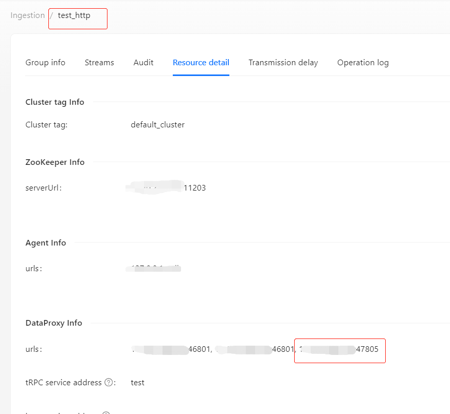
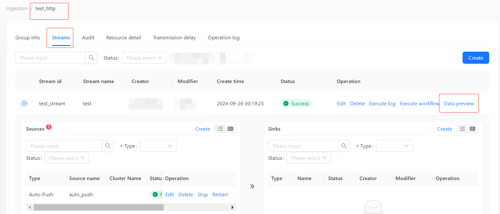
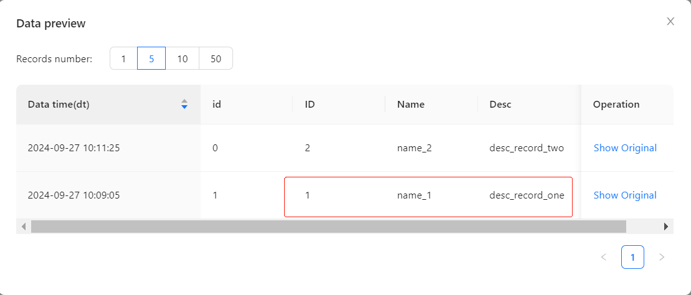

In the following content, we will use a complete example to introduce how to use HTTP to report data, quickly verify whether the applied {groupId, streamId} account is effective, and whether the data is accepted by InLong DataProxy and correctly written to the MQ cluster.

## Prepare resources
### Apply for a reporting account
We first need to apply for a reporting account in InLong's Manager. As shown in the following figure, we have applied for {test_http, test_stream} account information and the administrator has approved it:


In the application report stream, we defined that the data of this report stream is reported in CSV format. The data content consists of three fields (ID, Name, Desc) separated by vertical bars ("|"):


### Find the IP and port of the DataProxy node that supports HTTP access
InLong supports direct data reporting via HTTP. In this reporting example, we directly select a DataProxy that supports HTTP reporting from the resource details page of the reporting account to report the message. In the demonstration environment, the HTTP receiving port opened by DataProxy is 47805, as shown below:


At this point, we have obtained the account information required for data reporting, as well as the DataProxy node IP and port information to be reported by HTTP reporting. Next, we can report data through HTTP to verify whether the account and pipeline are available.

## Report data via HTTP
According to the HTTP reporting protocol requirements of InLong, we use curl tool to construct an HTTP instruction as shown below for execution. In the body part, we construct a record containing three field values according to the format definition of test_stream. {dataproxy_ip:dataproxy_httpport} is the DataProxy IP and port for receiving the reported message. You can replace it with the corresponding information in your environment:

```bash
curl -X POST -d 'groupId=test_http&streamId=test_stream&dt=data_time&body=1|name_1|desc_record_one&cnt=1' http://{dataproxy_ip:dataproxy_httpport}/dataproxy/message
```
- Parameter Description：

| parameter | meaning                               | Remark  |
|-----------|---------------------------------------|---------|
| groupId   | Data stream group id                  |         |
| streamId  | Data stream ID                        |         |
| body      | Data content to be pushed             |         |
| dt        | Data time to be pushed                |timestamp in millisecond     |
| cnt       | The count of data pieces to be pushed |         |

- Return Value：

| return value | meaning |
|--------------|---------|
| 0            | Success |
| !=0          | Failure |

## Check the reported data
We use the data preview function of the data stream test_http:test_stream to view the HTTP reporting status. This function directly samples the latest data from the MQ cluster corresponding to the data stream:


We can see that the data just reported has been successfully written to the MQ cluster:


At this point, we quickly and clearly know that the applied account and pipeline resources are available.

## FAQ
The return code and error message in the HTTP response will clearly indicate the specific cause of the error, such as the account does not exist, the reporting protocol format is not equal, etc., and the problem can be quickly solved by adjusting according to the corresponding error prompt or aligning with the system administrator.