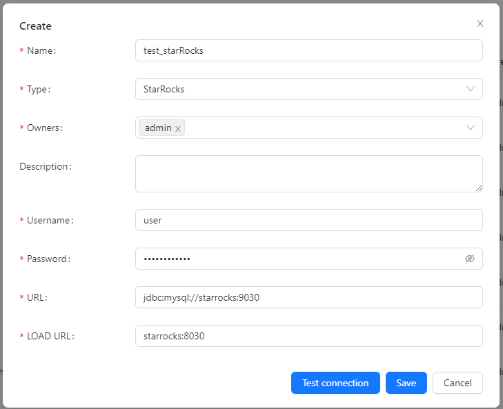
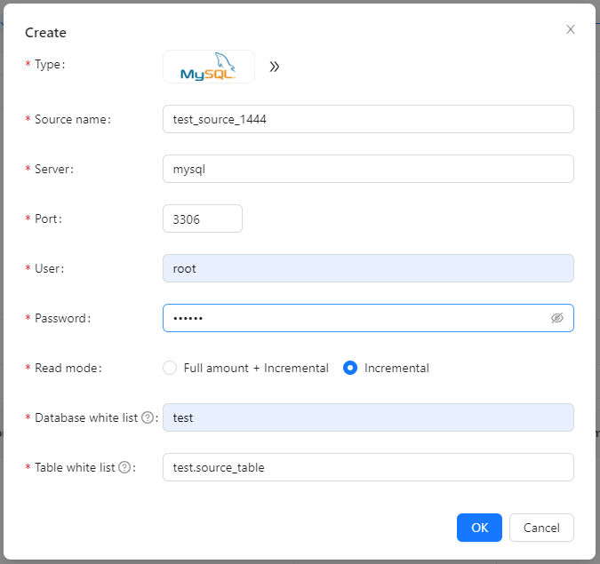

Here we use an example to introduce how to use Apache InLong creating `MySQL -> StarRocks` data synchronization.

## Deployment
### Install InLong

Before we begin, we need to install InLong. Here we provide two ways:
- [Docker Deployment](deployment/docker.md) (Recommended)
- [Bare Metal Deployment](deployment/bare_metal.md)

### Add Connectors

Download the [connectors](https://inlong.apache.org/downloads/) corresponding to Flink 1.13, and after decompression, place `sort-connector-starrocks-[vsersion]-SNAPSHOT.jar` in `/inlong-sort/connectors/` directory.

### Install StarRocks
Please refer to the [Installation Tutorial](https://docs.starrocks.io/docs/quick_start/) on the Apache StarRocks official website

## Cluster Initialize
When all containers are successfully started, you can access the InLong dashboard address http://localhost, and use the following default account to log in.
```
User: admin
Password: inlong
```

### Create Cluster Tag
Click [Clusters] -> [ClusterTags] -> [Create] on the page to specify the cluster label name and person in charge.


:::caution
Since each component reports the ClusterTags as `default_cluster` by default, do not use other names.
:::

### Register Pulsar Cluster
Click [Clusters] -> [Cluster] -> [Create] on the page to register Pulsar Cluster.


:::note
The ClusterTags selects the newly created `default_cluster`, the Pulsar cluster deployed by docker:

Service URL is `pulsar://pulsar:6650`, Admin URL is `http://pulsar:8080`.
:::

### Register StarRocks DataNodes
Click [DataNodes] -> [Create] on the page to register StarRocks DataNodes.


:::note
- Please do not fill in `http://` for LOAD URL, just fill in `IP:PORT`.
:::

## Create Task
### Create Data Streams Group
Click [Synchronization] → [Create] on the page and input the Group ID, Steam ID and Full database migration:


### Create Data Source
In the data source, click [New] → [MySQL] to configure the source name, address, databases and tables information.


:::note
- When the read mode is selected as `Full + Incremental`, the existing data in the table will also be collected, but not in the `Incremental` mode.
- The table white list format is `<dbName>.<tableName>` and supports regular expressions.
:::

### Create Data Sink
In the data sink, click [New] → [StarRocks] to configure the sink name, database name, table name and created StarRocks data node.


### Approve Data Stream
Click [Approval] -> [MyApproval] -> [Approval] -> [Ok].


Back to [Synchronization] page, wait for [success].


## Test Data
### Send Data
```
#!/bin/bash

# MySQL info
DB_HOST="mysql"
DB_USER="root"
DB_PASS="inlong"
DB_NAME="test"
DB_TABLE="source_table"

# Insert data in a loop
for ((i=1; i<=1000; i++))
do
    # Generate data
    id=$i
    name="name_$i"

    # Build an insert SQL
    query="INSERT INTO $DB_TABLE (id, name) VALUES ($id, '$name');"

    # Execute insert SQL
    mysql -h $DB_HOST -u $DB_USER -p$DB_PASS $DB_NAME -e "$query"
done
```

Add a total of 1000 pieces of data to the `source_table`:


### Verify Data
Enter StarRocks, check data in `sink_table`.

