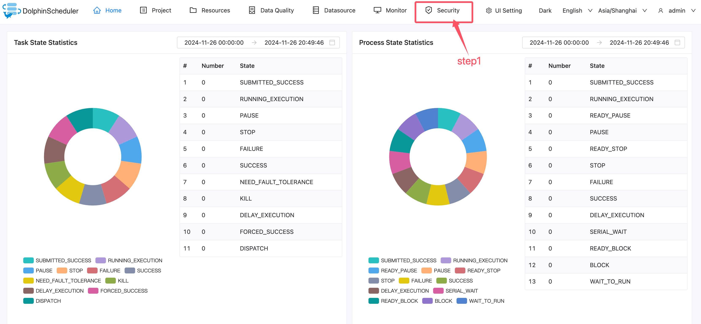
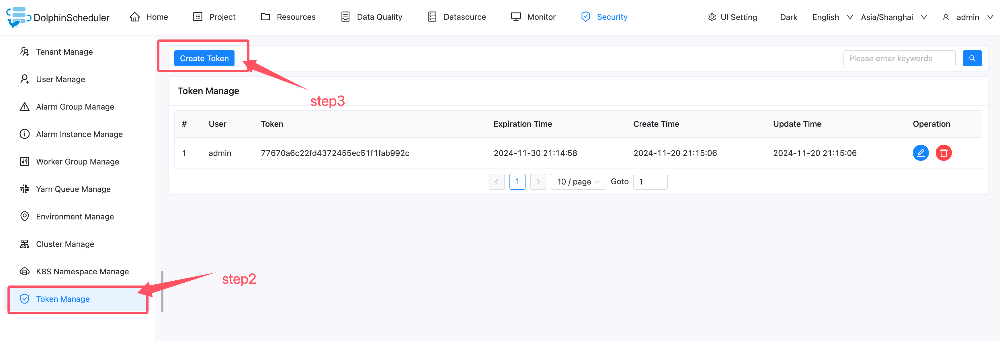
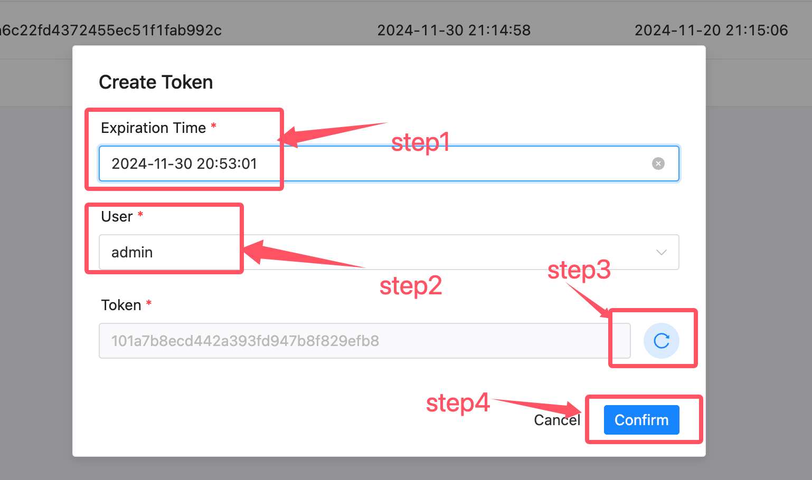
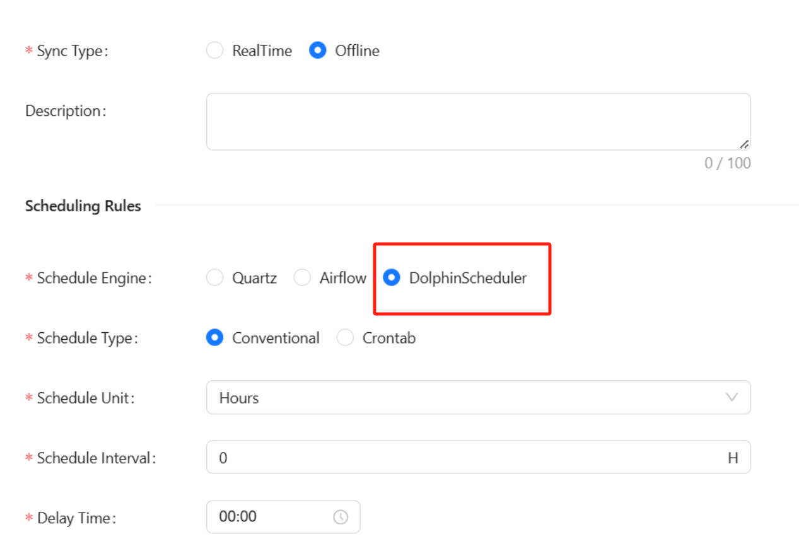
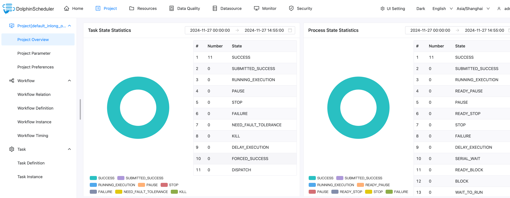
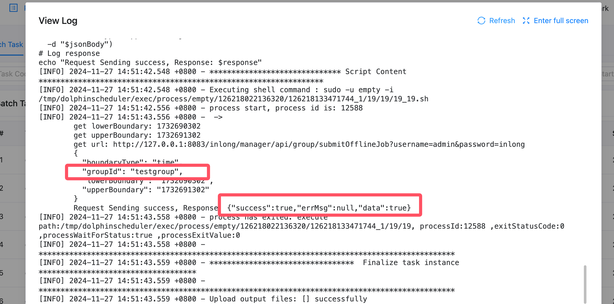
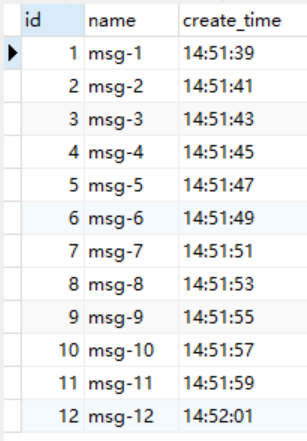

In the following content, we will introduce how to use DolphinScheduler third-party schedule engine in Apache InLong to create offline data synchronization.

## Deployment

### Install InLong

Before we begin, we need to install InLong and a usable DolphinScheduler. Here we provide two ways:

- [Docker Deployment](deployment/docker.md) (Recommended)
- [Bare Metal Deployment](deployment/bare_metal.md)

### Add Connectors

Download the [connectors](https://inlong.apache.org/downloads/) corresponding to Flink version, and after decompression, place `sort-connector-jdbc-[version]-SNAPSHOT.jar` in `/inlong-sort/connectors/` directory.

> Currently, Apache InLong's offline data synchronization capability only supports Flink-1.18, so please download the 1.18 version of connectors.

### Operations on DolphinScheduler

Before using DolphinScheduler as your scheduling engine, please make sure you have a working DolphinScheduler on hand. If you need to deploy a DolphinScheduler for yourself, please refer to the [DolphinScheduler Official Document](https://dolphinscheduler.apache.org/zh-cn)





Go into Token Manager page to create a token for InLong to access



Set parameters for the token according to the steps in the figure, include [Expiration Time], [User], then generate a token.


### Modify configuration in InLong Manager

For third-party scheduling engine, we need to modify configurations in manager

For DolphinScheduler engine there are following configurations need to be modified:

* `schedule.engine.inlong.manager.url` : Third-party scheduling engine needs to access the inlong manager through this url
* `schedule.engine.dolphinscheduler.url` : DolphinScheduler deployment url, general format is http://{ip}:{port}/dolphinscheduler
* `schedule.engine.dolphinscheduler.token` : Token you just generated in Token Manager of DolphinScheduler


After doing this, restart the InLong Manager to ensure the configuration is enabled.

### Use DolphinScheduler in offline synchronization

During configure the offline synchronization task, choose DolphinScheduler when selecting the scheduling engine, then configure other parameters



For details about how to manage clusters and configure data nodes, see [Use Quartz built-in scheduling engine](quartz_example.md)

After approval data flow, return to the [Synchronization] page and wait for the task configuration to succeed. Once configured successfully, the DolphinScheduler will periodically calls back InLong to synchronize offline data and the Manager will periodically submit Flink Batch Jobs to the Flink cluster.





View the DolphinScheduler task instance logs. The following logs indicate that the configuration is successful



## Test Data

### Sending Data

Use the Pulsar SDK to produce data into the Pulsar topic. An example is as follows:

```java
        // Create Pulsar client and producer
        PulsarClient pulsarClient = PulsarClient.builder().serviceUrl("pulsar://localhost:6650").build();
        Producer<byte[]> producer = pulsarClient.newProducer().topic("public/default/test").create();

        // Send messages
        for (int i = 0; i < 10000; i++) {
            // Field separator is |
            String msgStr = i + "|msg-" + i;
            MessageId msgId = producer.send(msgStr.getBytes(StandardCharsets.UTF_8));
            System.out.println("Send msg : " + msgStr + " with msgId: " + msgId);
        }
```

### Data Validation

Then enter MySQL to check the data in the table:


