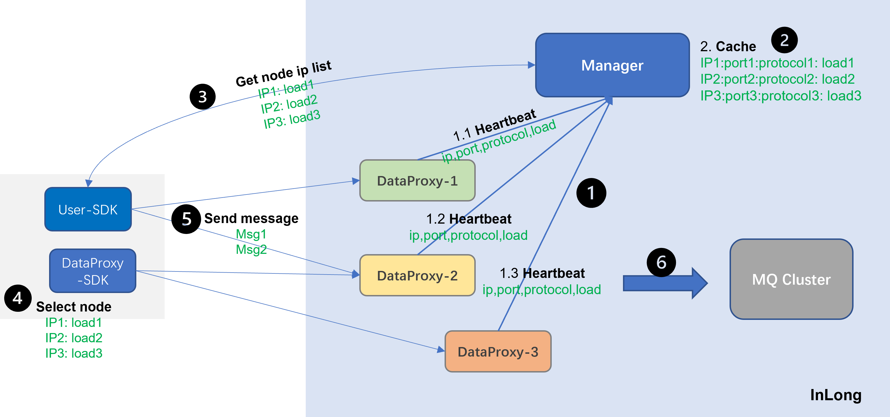

## HTTP report process introduction
InLong processes HTTP report through the DataProxy node. The data source regularly obtains the access point list from the Manager, then selects available HTTP DataProxy nodes from the access point list according to its own policies, and then uses the HTTP protocol for data production; due to the performance of HTTP report due to problems such as low proportion of valid data and easy loss of request messages, it is recommended that users use TCP to report data as much as possible. The overall HTTP report process is shown below:



- Heartbeat report: DataProxy regularly reports heartbeats to the Manager, providing {IP, Port, Protocol, Load} information that the node has enabled access to;

- Online node cache: Manager caches the heartbeat information reported by DataProxy, senses the available access nodes in the cluster, and the available reported access information;

- Access point acquisition: HTTP SDK (the data source adopts HttpProxySender implemented by DataProxy-SDK, or the HTTP report SDK developed by itself according to the HTTP report protocol) regularly through "/inlong/manager/openapi/dataproxy/getIpList/{inlongGroupId}" The method obtains the available report access point list information corresponding to the currently reported groupId from the Manager;

- Access point selection: HTTP SDK selects the DataProxy node to be reported according to the report node selection strategy;

- Data report: HTTP SDK constructs a message according to the HTTP report protocol, sends a request message to the selected DataProxy node, and after receiving the response, performs operations such as whether to resend and output exceptions based on the response result;

- Data acceptance: DataProxy checks the HTTP message, and returns a success response if it is accepted successfully, and forwards the message to the MQ cluster; if the message format or value does not meet the specifications, or the message processing fails, DataProxy returns a failure response, and the response carries the corresponding Error code and detailed error message.


## Create real-time synchronization task
Create a task on the Dashboard or through the command line, and use `Auto Push` (autonomous push) as the data source type.


## Method 1: Call the interface to report (CURL)
```bash
curl -X POST -d 'groupId=give_your_group_id&streamId=give_your_stream_id&dt=data_time&body=give_your_data_body&cnt=1' http://dataproxy_url:46802/dataproxy/message
```
- Parameter Description：

| parameter | meaning                               | Remark  |
|-----------|---------------------------------------|---------|
| groupId   | Data stream group id                  |         |
| streamId  | Data stream ID                        |         |
| body      | Data content to be pushed             |         |
| dt        | Data time to be pushed                |timestamp in millisecond     |
| cnt       | The count of data pieces to be pushed |         |

- Return Value：

| return value | meaning |
|--------------|---------|
| 0            | Success |
| !=0          | Failure |

## Method 2：Encapsulate the HTTP client（Java)
The following packages need to be imported first `httpclient`、`commons-lang3`、`jackson-databind` code example:
```java
public class DataPush {

    private static CloseableHttpClient httpClient;
    private static final ObjectMapper OBJECT_MAPPER = new ObjectMapper();
    private final Random rand = new Random();

    private String sendByHttp(List<String> bodies, String groupId, String streamId, long dataTime,
            long timeout, TimeUnit timeUnit, List<String> addresses) throws Exception {
        if (null == addresses || addresses.isEmpty()) {
            throw new RuntimeException("addresses are null");
        }
        HttpPost httpPost = null;
        CloseableHttpResponse response = null;
        try {
            if (httpClient == null) {
                httpClient = constructHttpClient(timeout, timeUnit);
            }
            int randomNum = rand.nextInt((addresses.size() - 1) + 1);
            String url = "http://" + addresses.get(randomNum) + "/dataproxy/message";

            httpPost = new HttpPost(url);
            httpPost.setHeader(HttpHeaders.CONNECTION, "close");
            httpPost.setHeader(HttpHeaders.CONTENT_TYPE, "application/x-www-form-urlencoded");
            ArrayList<BasicNameValuePair> contents = getContents(bodies, groupId, streamId, dataTime);
            String s = URLEncodedUtils.format(contents, StandardCharsets.UTF_8);
            httpPost.setEntity(new StringEntity(s));

            response = httpClient.execute(httpPost);
            String returnStr = EntityUtils.toString(response.getEntity());

            if (StringUtils.isNotBlank(returnStr) && response.getStatusLine().getStatusCode() == 200) {
                JsonNode jsonNode = OBJECT_MAPPER.readTree(returnStr);
                if (jsonNode.has("code")) {
                    int code = jsonNode.get("code").asInt();
                    if (code == 0) {
                        return "success";
                    } else {
                        return "fail";
                    }
                }

            } else {
                throw new Exception("exception to get response from request " + returnStr + " "
                        + response.getStatusLine().getStatusCode());
            }

        } finally {
            if (httpPost != null) {
                httpPost.releaseConnection();
            }
            if (response != null) {
                response.close();
            }
        }
        return "fail";
    }

    private static synchronized CloseableHttpClient constructHttpClient(long timeout, TimeUnit timeUnit) {
        if (httpClient != null) {
            return httpClient;
        }
        long timeoutInMs = timeUnit.toMillis(timeout);
        RequestConfig requestConfig = RequestConfig.custom()
                .setConnectTimeout((int) timeoutInMs)
                .setSocketTimeout((int) timeoutInMs).build();
        HttpClientBuilder httpClientBuilder = HttpClientBuilder.create();
        httpClientBuilder.setDefaultRequestConfig(requestConfig);
        return httpClientBuilder.build();
    }

    private static ArrayList<BasicNameValuePair> getContents(List<String> bodies,
            String groupId, String streamId, long dt) {
        ArrayList<BasicNameValuePair> params = new ArrayList<BasicNameValuePair>();
        params.add(new BasicNameValuePair("groupId", groupId));
        params.add(new BasicNameValuePair("streamId", streamId));
        params.add(new BasicNameValuePair("dt", String.valueOf(dt)));
        params.add(new BasicNameValuePair("body", StringUtils.join(bodies, "\n")));
        params.add(new BasicNameValuePair("cnt", String.valueOf(bodies.size())));
        return params;
    }
}
```