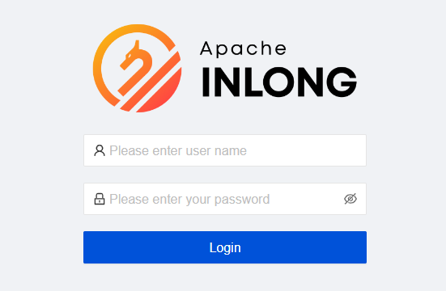
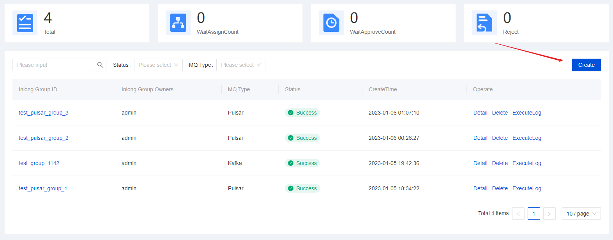
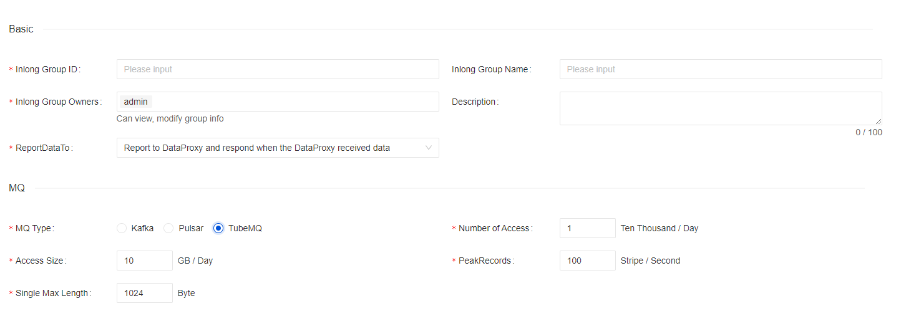
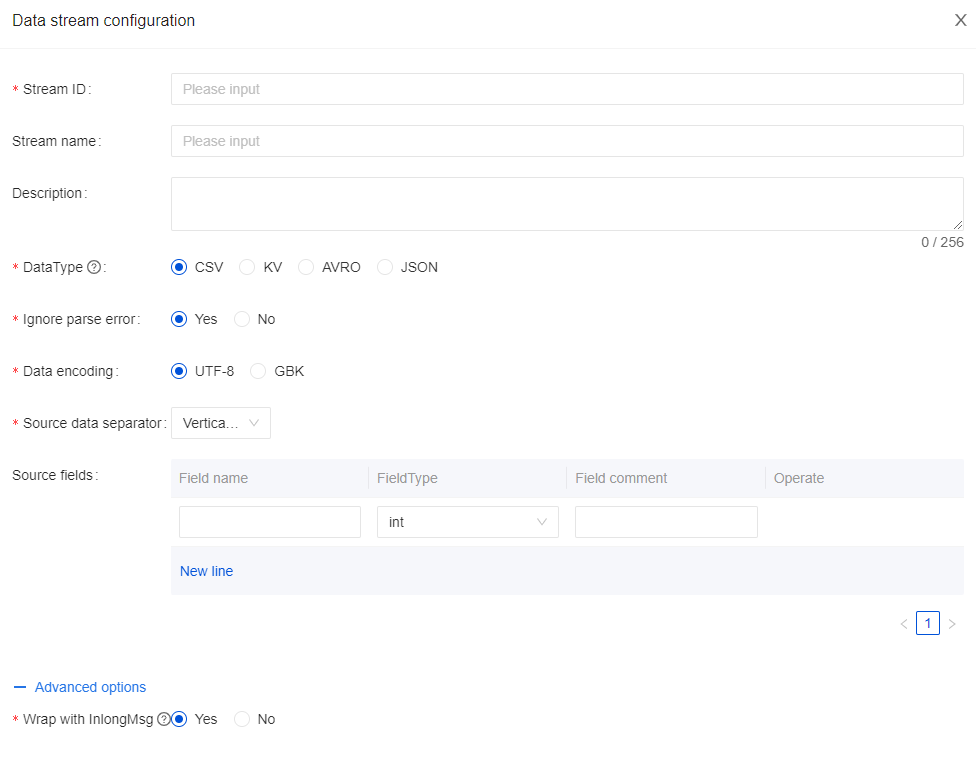
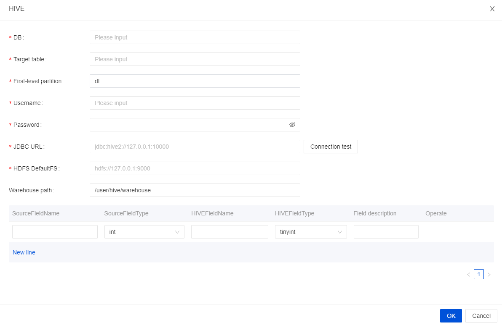
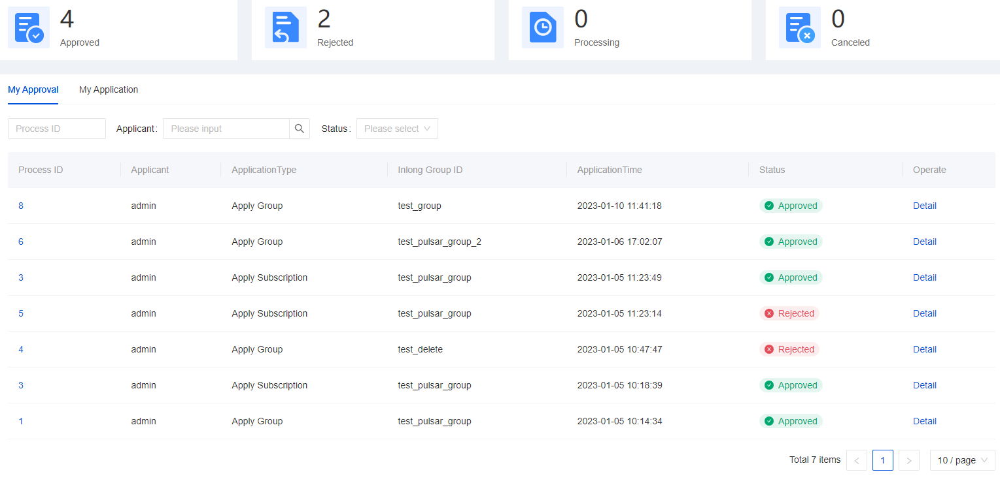
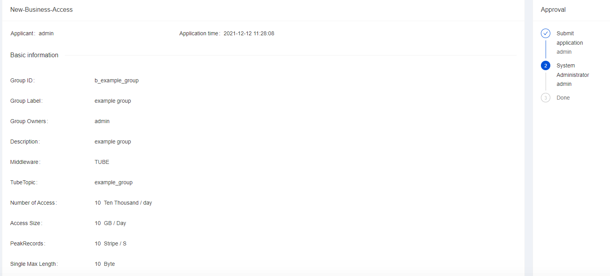
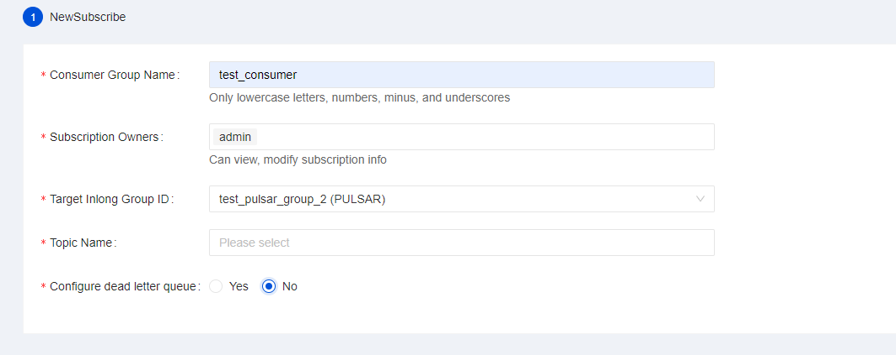

## User Login

Requires the user to enter the account name and password of the system, default account is `admin inlong`.

## Data Access

The data access module displays a list of all tasks connected to the system within the current user authority, and can
view, edit, update and delete the details of these tasks.

Click [Create], there are two steps to fill in data access information: Group information, data stream.

### Data Stream Group Information

#### Access Requirements

Access requirements require users to choose message middleware: high throughput (TUBE) or High reliability (PULSAR):

high throughput (TUBE): high-throughput message transmission component, suitable for log message transmission.
high reliability (PULSAR): high-reliability message transmission component, suitable for billing transmission.

#### Group Information

You are required to fill in basic data stream group information for access tasks.

- Group Name: Unified lowercase English name, please try to include the product name and concise
  specifications, such as pay_base
- Group Label: the label of the group, easy to use and retrieve, up to 128 characters
- Group responsible person: at least 1 people, the group responsible person can view and modify group
  information, add and modify all access configuration items
- Group introduction: Cut SMS to introduce the group background and application of this access task:

#### Access Scale

The scale of access requires users to judge the scale of access data in advance, to allocate computing and storage
resources later.

### Data Stream

Click [Next] to enter the data stream information filling step. There are four modules for data stream information filling:
basic information, data source, data information, and data stream.

In the data stream process, you can click [Create] to create a new data stream:

#### Basic Information

You are required to fill in the basic information of the data stream in the access task:

- Data stream id: The prefix is automatically generated according to the product/project, which is unique in a 
  specific group and is consistent with the stream id in the data source and the storage table
- Data stream name: interface information description, the length is limited to 64 characters (32 Chinese characters)
- Data stream owner: The data stream owner can view and modify data stream information, add and modify all access
  configuration items
- Introduction to data stream: simple text introduction to data stream

#### Data Sources

You are required to select the source of the data stream.

Currently, two methods of file and independent push are supported, and the detailed information of the data source can
be supplemented in the advanced options.

- File: The business data is in the file, and the business machine deploys InLong Agent, which is read according to
  customized policy rules
- Autonomous push: Push data to the messaging middleware through the SDK

#### Data Information

You are required to fill in the data-related information in the data stream.

- Data Format
- Data encoding
- Source field separator
- Source data field

#### Data Storage

You are required to select the final flow direction of this data stream, this part is not currently supports both hive storage
and autonomous push.

Add HIVE storage:

- Target database: hive database name (prepared to create in advance)
- Target table: hive table name
- First-level partition: the field name of the first-level subdirectory of hdfs data divided by hive data
- Secondary partition: the field name of the first-level subdirectory of hdfs data divided by hive data
- Username: hive server connection account name
- User password: hive server connection account password
- HDFS url: Hive bottom HDFS connection
- JDBC url: jdbc url of hive server
- Field related information: source field name, source field type, HIVE field name, HIVE field type, field description,
  and support deletion and addition

## My Application

The approval management function module currently includes my application and my approval, and all tasks of data access
and consumption application approval in the management system.

Display the current task list submitted by the applicant for data access and consumption in the system, click [Details]
to view the current basic information and approval process of the task.

#### Application Data Access Details

Data access task detailed display The current basic information of the application task includes: applicant-related
information, basic information about application access, and current approval process nodes.

## Data Consumption

Data consumption currently does not support direct consumption access to data, and data can be consumed normally after
the approval process.

Click [Create] to enter the data consumption process, and you need to fill in information related to
consumption.

### Consumer Information

Applicants need to gradually fill in the basic consumer data stream group information related to data consumption applications in
the information filling module

- Consumer group name: The brief name of the
  consumer must be composed of lowercase letters, numbers, and underscores. The final approval will assign the consumer
  name based on the abbreviation splicing
- Consumer Responsible Person: At least 2 persons are required to choose the responsible person; the responsible person
  can view and modify the consumption information
- Consumer target data stream group id: you need to select the group id of the consumer data, you can click [Query] and 
  select the appropriate group id in the pop-up window
- Data usage: select data usage usage
- Data usage description: The applicant needs to briefly explain the items used and the purpose of the data according to
  their own consumption scenarios After completing the information, click [Submit], and the data consumption process
  will be formally submitted to the approver before it will take effect.