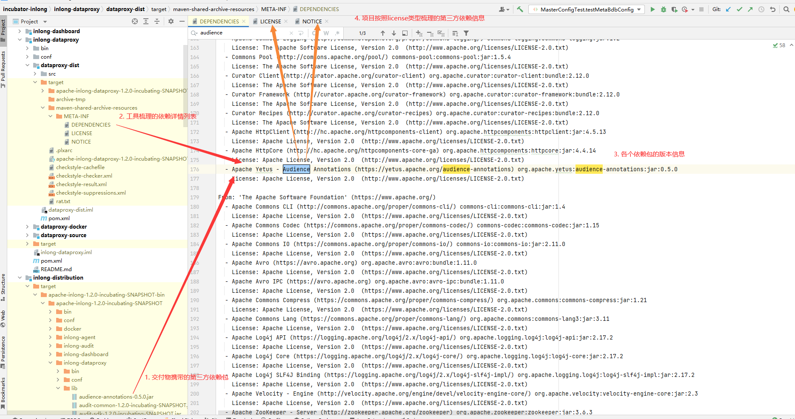
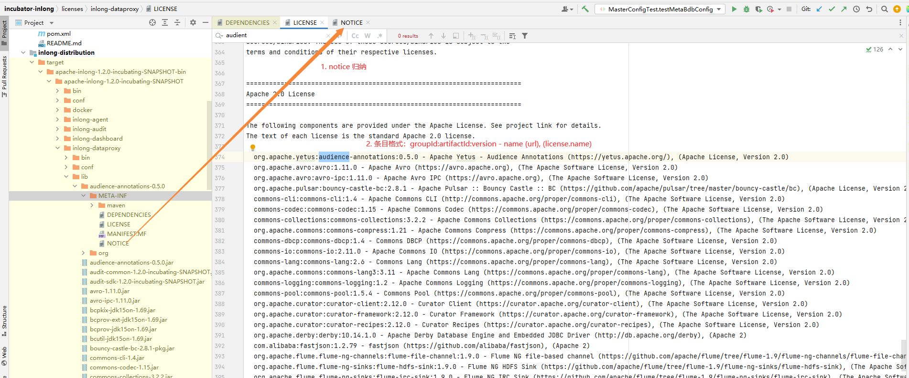
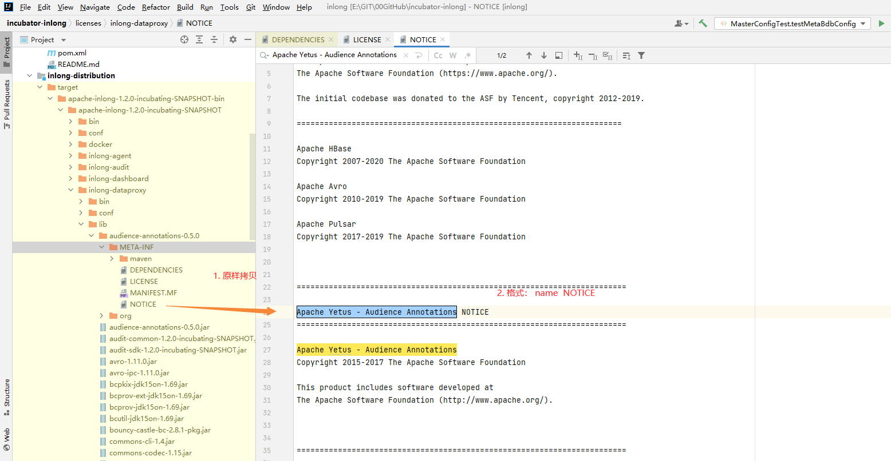

## 为什么要维护第三方依赖
   不同的依赖包含了不同的LICENSE，Apache项目使用的第三方依赖必须严格遵守[ASF 第 3 方许可政策](https://www.apache.org/legal/resolved.html) ，该政策将第三方依赖的各种LICENSE分为了3类：A类，B类，X类，并对哪种授权协议属于哪一类做了详细而明确的枚举定义；Apache项目交付物里必须不能包含带有X类的授权协议依赖包，无论是直接依赖还是间接依赖，都不允许。

## 涉及的操作
   基于[ASF 第 3 方许可政策](https://www.apache.org/legal/resolved.html) ，我们已经对InLong项目的所有依赖做了一次完整的梳理及检查，确保版本的所有第三方依赖已经是符合Apache规范要求的状态；由于项目是不断迭代发展的，后续大家需要按照统一的标准对第三方依赖包进行检查和维护，包括：
   1. 对项目新增模块；
   2. 对项目已有的模块进行如下操作：
      1. 新增新第三方依赖；
      2. 删除已有的第三方依赖；
      3. 修改已有第三方依赖的版本号；
   3. 版本发布前对交付物进行发版检查

   上面操作的核心即新增或修改各个pom.xml的操作时,我们需要检查项目的第三方依赖情况并对已有项目的第三方依赖梳理进行变更.
   
## 第三方依赖梳理方法
   1. 第三方依赖的LICENSE及NOTICE汇总位置：
      我们目前是按照项目的模块名将各个模块的第三方依赖的LICENSE及NOTICE汇总到[第三方license目录](https://github.com/apache/incubator-inlong/tree/master/licenses) ， 大家导入项目后即可看到如下内容：
   2. 交付物的第三方依赖如何映射：
      我们以inlong-dataproxy模块为例，我们首先通过mvn clean package install命令进行本地打包，获取各个依赖包的详情信息：；
      从图我们可以看到，我们获得了模块的DEPENDENCIES文件，我们根据交付物例里依赖包的artifactId查找DEPENDENCIES文件对应条目，将该依赖按照LICENSE的类型归档梳理：，这里的条目格式为 ”groupId:artifactId:version - name (url), (license.name)“，每个单元按照artifactId的字母进行排序；
      该项目存在NOTICE，我们需要将对应NOTICE原文拷贝到inlong-dataproxy模块的NOTICE文件中：，如果NOTICE原文超过10行，则原文放置到notices子目录里；
   3. 特别情况：如果依赖包里没有携带LICENSE和（或，有可能是有LICENSE但没有NOTICE）NOTICE文件，我们需要查找该依赖包对应的项目源码，查找到对应源码里的LICENSE和NOTICE，并添加到如上目录中，可以参考ZooKeeper组件的梳理方式：。
   4. 梳理目标：Apache项目交付物里必须不能包含带有X类的授权协议依赖包，无论是直接依赖还是间接依赖，都不允许存在。

   
