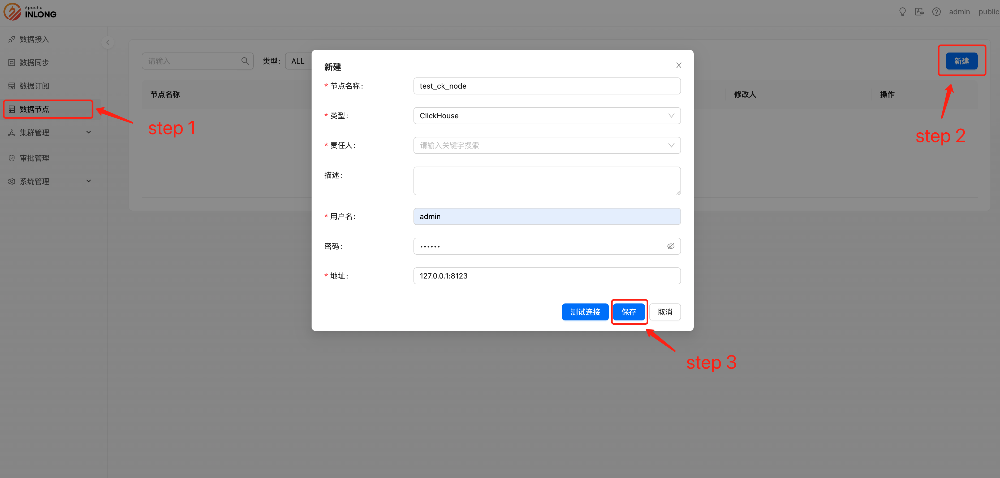
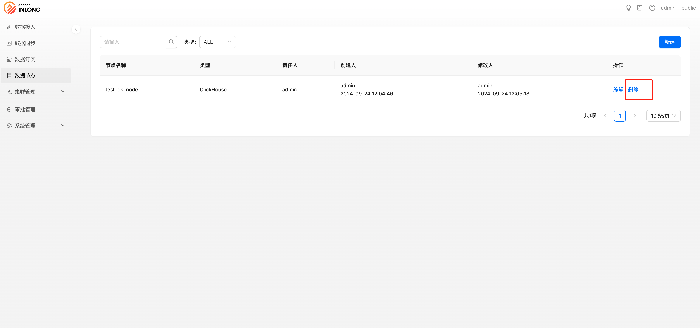
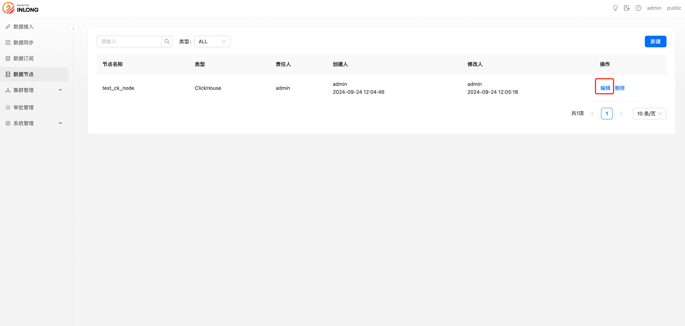
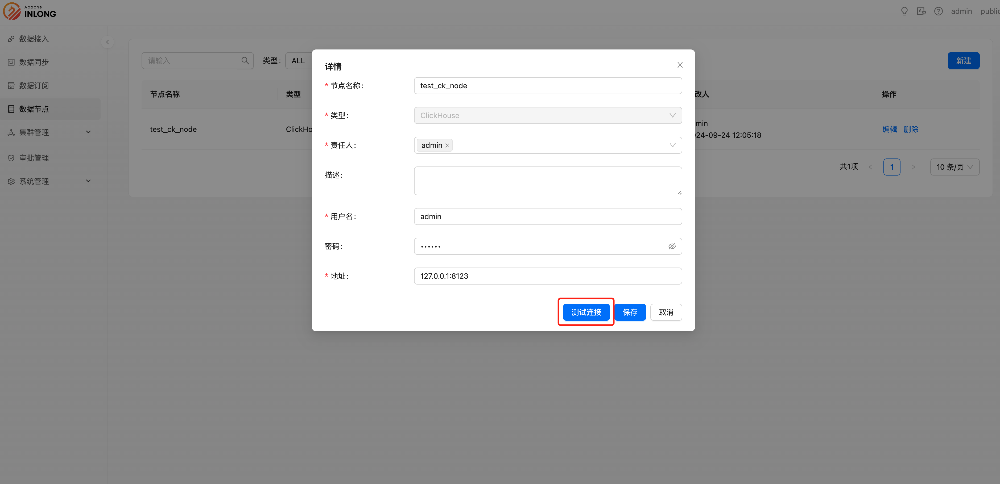
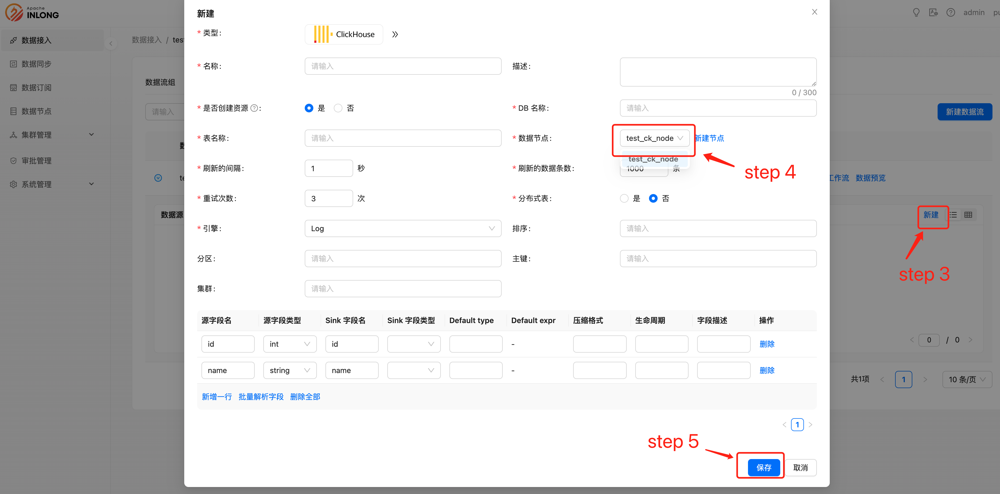

节点管理主要提供数据节点信息复用的能力，用户可以在新建、修改、删除数据节点，并且在进行数据接入时，复用配置好的数据节点信息：

### 新建数据节点

用户可以通过新建数据节点来生成一个常用的节点信息：

- 节点名：用户自定义名，用来标识此节点信息
- 类型：节点类型
- 责任人：该节点负责人，只有责任人能够修改该节点的配置信息
- 描述：节点描述信息

以上为节点的公用配置，另外，根据不同的节点类型，还会有不同的配置信息，如 ClickHouse 节点需要填写用户名、密码、ClickHouse 地址信息。

### 删除数据节点

用户可以对已创建节点进行删除，删除后此节点将停止使用：

### 修改数据节点

用户可以修改节点信息，点击【编辑】，输入新的节点信息，确认后此节点配置将生效：

### 测试连接

用户通过测试连接校验节点状态是否能够正常：

### 使用节点

用户配置好节点后，可以在数据订阅中使用已经配置好的节点信息：

- 选择`数据接入`，点击`详情`
  
- 选择数据目标`新建`，选择已经配置好的数据节点，并完善其他配置后点击保存。
  
  至此完成了节点的使用