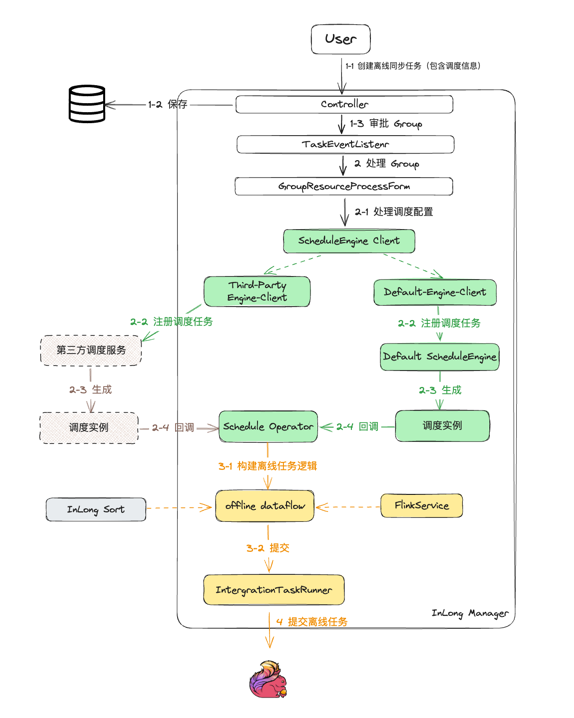

## 概述
目前，Apache InLong 支持数据实时同步和离线同步，底层的数据计算引擎都是 Flink。

Apache InLong 通过流批统一的 Flink SQL API 实现一套代码同时支持实时和离线的数据同步任务的能力。
两者的区别是实时同步使用 Flink Streaming 实现数据同步，而离线同步则是使用 Flink Batch 实现数据同步。
在实际使用中，用户可以根据自己的需求选择合适的同步方式。

本文描述如何扩展离线同步 connector 插件以及如何扩展第三方调度服务。

## 离线数据源扩展

离线同步和实时同步一样，也主要包括 Source 和 Sink 两部分，最大的区别在于 Source 是否有界：
- 实时同步的 Source 是无边界的
- 离线同步的 Source 是有边界的

边界是指离线数据源具有明确的起始和结束，一般采用批处理的方式来做离线数据同步。
离线数据源复用了实时同步的 Flink Connector，并且增加了 Source 的是否有边界的属性，Sink 的实现和实时同步的 Sink 一致。

Flink 的 Source 中提供了接口来设置数据边界的接口：
```java
    /**
     * Get the boundedness of this source.
     *
     * @return the boundedness of this source.
     */
    Boundedness getBoundedness();
```
Boundedness 是一个枚举类型，有两个值：
```java
@Public
public enum Boundedness {
    /**
     * A BOUNDED stream is a stream with finite records.
     */
    BOUNDED,

    /**
     * A CONTINUOUS_UNBOUNDED stream is a stream with infinite records.
     */
    CONTINUOUS_UNBOUNDED
}
```
以 Pulsar Source 为例，来描述如何为 Pulsar Source 设置边界属性。
### 数据源边界
边界由 `Boundaries` 确定，包括 
- `lowerBound` ：表示边界的起始位置
- `upperBound` ：表示边界的结束位置
- `boundaryType` ： 表示边界的类型，目前支持 `TIME` 和 `OFFSET` 两种类型
```java
public class Boundaries {
    public String lowerBound;
    public String upperBound;
    public BoundaryType boundaryType;
}
```
边界信息是由 `ExtractNode` 携带的，`ExtractNode` 对应 Flink 的 Source。
```java
public abstract class ExtractNode implements Node {
    public void fillInBoundaries(Boundaries boundaries) {
        Preconditions.checkNotNull(boundaries, "boundaries is null");
        // every single kind of extract node should provide the way to fill in boundaries individually
    }
}
```
### Source 的边界设置
`PulsarExtractNode` 中会将 Boundaries 信息配置到 Pulsar Connector 的相关参数中：
```java
@Override
    public void fillInBoundaries(Boundaries boundaries) {
        super.fillInBoundaries(boundaries);
        BoundaryType boundaryType = boundaries.getBoundaryType();
        String lowerBoundary = boundaries.getLowerBound();
        String upperBoundary = boundaries.getUpperBound();
        if (Objects.requireNonNull(boundaryType) == BoundaryType.TIME) {
            // 设置时间边界
            sourceBoundaryOptions.put("source.start.publish-time", lowerBoundary);
            sourceBoundaryOptions.put("source.stop.at-publish-time", upperBoundary);
            log.info("Filled in source boundaries options");
        } else {
            log.warn("Not supported boundary type: {}", boundaryType);
        }
    }
```
这些参数会被 PulsarSource 感知到，在初始化 PulsarSource 时，会为 Source 设置一个 `BoundedStopCursor`
```java
@Override
public ScanRuntimeProvider getScanRuntimeProvider(ScanContext context) {
    PulsarDeserializationSchema<RowData> deserializationSchema =
            deserializationSchemaFactory.createPulsarDeserialization(context);
    PulsarSourceBuilder<RowData> sourceBuilder = PulsarSource.builder();
    sourceBuilder
            .setTopics(topics)
            .setStartCursor(startCursor)
            .setDeserializationSchema(deserializationSchema)
            .setProperties(properties);
    if (!(stopCursor instanceof NeverStopCursor)) {
        // 设置 stop cursor
        sourceBuilder.setBoundedStopCursor(stopCursor);
    } else {
        sourceBuilder.setUnboundedStopCursor(stopCursor);
    }
    return SourceProvider.of(sourceBuilder.build());
}
```
如果配置了 `BoundedStopCursor`，则会将 Source 的 `boundedness` 属性设置为 `Boundedness.BOUNDED`。
```java
public PulsarSourceBuilder<OUT> setBoundedStopCursor(StopCursor stopCursor) {
        this.boundedness = Boundedness.BOUNDED;
        this.stopCursor = checkNotNull(stopCursor);
        return this;
    }
```
这样 Flink 引擎就可以感知这是一个有边界的 Source，从而使用 Batch 的方式来处理数据。

## 离线同步任务调度
离线同步是基于 Flink batch 的任务，并且可以按照一定的周期进行调度，每个 Flink Batch 任务都是由调度系统触发的。 InLong 内置了基于 Quartz 的调度系统，可以支持离线任务的调度。

离线同步任务调度的整体流程如图所示：



- 用户创建离线同步任务
- 任务审批之后，会通过 `ScheduleClient` 向调度系统注册任务
- 调度服务会根据调度的配置信息，周期性的生成调度实例
- 调度实例会回调 InLong 的 `Schedule Operator`，发起一次任务执行，回调中会携带任务的详细信息，包括 GroupId、StreamId、任务起始和结束边界等参数
- `Schedule Operator` 会根据任务的详细信息，创建一个 Flink Job，提交到 Flink 集群中执行

### 调度能力扩展
InLong 的离线调度能力支持第三方调度系统，接下来介绍如何扩展调度能力。

#### 调度任务注册
`ScheduleClient` 是调度任务注册的客户端，用户可以通过 `ScheduleClient` 向调度系统注册任务。
`ScheduleClient` 会根据 `ScheduleInfo` 中的 `engineType` 来选择调度引擎，用户可以通过实现 `ScheduleEngineClient` 接口来扩展调度能力。

```java
public interface ScheduleEngineClient {
    /**
     * Check whether scheduleEngine type is matched.
     * */
    boolean accept(String engineType);
    /**
     * Register schedule to schedule engine.
     * @param scheduleInfo schedule info to register
     * */
    boolean register(ScheduleInfo scheduleInfo);
    /**
     * Un-register schedule from schedule engine.
     *
     * @param groupId schedule info to unregister
     */
    boolean unregister(String groupId);
    /**
     * Update schedule from schedule engine.
     * @param scheduleInfo schedule info to update
     * */
    boolean update(ScheduleInfo scheduleInfo);
}
```
`ScheduleEngineClient` 提供了注册、注销、更新调度任务的能力，用户可以根据自己的需求实现这些接口。

#### 调度任务执行
调度任务的执行依赖于调度服务，调度服务会根据调度配置信息，周期性的生成调度实例，然后回调 InLong 的 `Schedule Operator`，发起一次任务执行。
以内置的 Quartz 调度服务为例来展示调度系统如何周期性触发离线同步任务。

```java
public interface ScheduleEngine {
    /**
     * Start schedule engine.
     * */
    void start();
    /**
     * Handle schedule register.
     * @param scheduleInfo schedule info to register
     * */
    boolean handleRegister(ScheduleInfo scheduleInfo);
    /**
     * Handle schedule unregister.
     * @param groupId group to un-register schedule info
     * */
    boolean handleUnregister(String groupId);
    /**
     * Handle schedule update.
     * @param scheduleInfo schedule info to update
     * */
    boolean handleUpdate(ScheduleInfo scheduleInfo);
    /**
     * Stop schedule engine.
     * */
    void stop();
}
```
`QuartzScheduleEngine` 提供了 `Scheduler` 调度器，针对于 `ScheduleEngineClient` 的注册、注销、更新请求， 提供了的启动、停止、注册、注销、更新调度任务的能力。

`QuartzScheduleEngine` 目前提供了基于调度周期配置以及基于 crontab 表达式的周期调度能力，每个周期产生的调度实例中包含了触发时间、周期等信息，根据这些信息完成对 InLong 数据同步任务的拉起。

每个调度实例都对应于一个 `QuartzOfflineSyncJob`, `QuartzOfflineSyncJob` 向 `Manager` 发起一次 `OfflineJobRequest`
```java
public class OfflineJobRequest {

    @ApiModelProperty("Inlong Group ID")
    @NotNull
    private String groupId;

    @ApiModelProperty("Source boundary type, TIME and OFFSET are supported")
    @NotNull
    private String boundaryType;

    @ApiModelProperty("The lower bound for bounded source")
    @NotNull
    private String lowerBoundary;

    @ApiModelProperty("The upper bound for bounded source")
    @NotNull
    private String upperBoundary;
}
```
`OfflineJobRequest` 包含了 GroupId、StreamId、任务起始和结束边界等参数。

在扩展第三方调度引擎时，用户需要同样的在调度实例中构建 `OfflineJobRequest`，并向 `Manager` 发起任务执行请求。

## 总结
本文主要描述了离线数据同步的扩展方法，包括如何基于实时同步的数据源来扩展离线同步的能力，以及如何扩展支持第三方的调度引擎。

