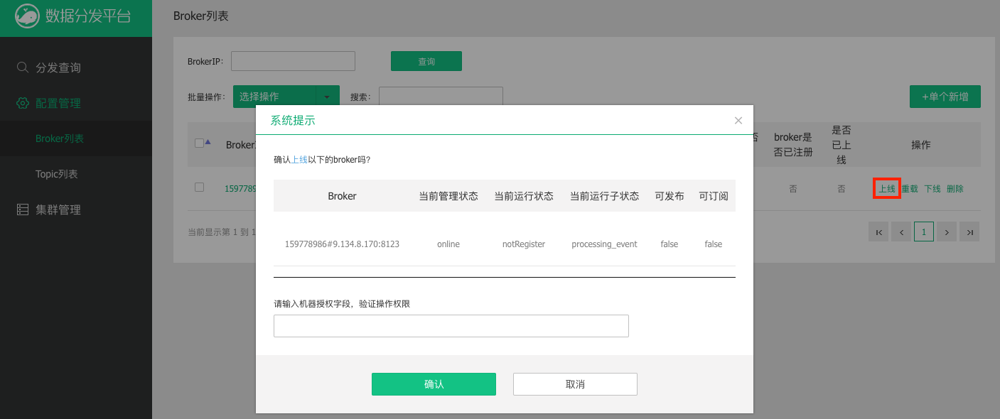
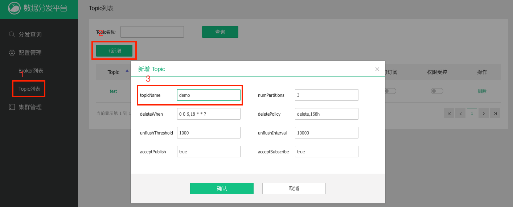
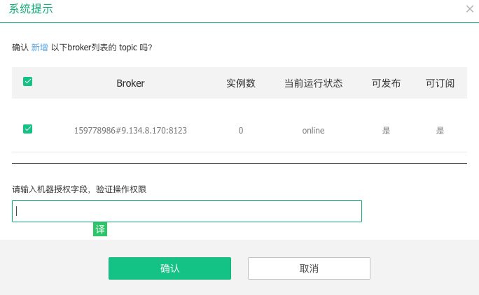

## 1 部署运行

### 1.1 配置示例
TubeMQ 集群包含有两个组件: **Master** 和 **Broker**. Master 和 Broker 可以部署在相同或者不同的节点上，依照业务对机器的规划进行处理。我们通过如下3台机器搭建有2台Master的生产、消费的集群进行配置示例：

| 所属角色 | TCP端口 | TLS端口 | WEB端口 | 备注                                       |
| --- | --- | --- | --- |------------------------------------------|
| Master | 8099 | 8199 | 8080 | 元数据存储在ZooKeeper的`/tubemq`目录              |
| Broker | 8123 | 8124 | 8081 | 消息储存在`/stage/msg_data`                   |
| ZooKeeper | 2181 |  |  | 存储Master元数据及Broker的Offset内容，根目录`/tubemq` |

### 1.2 准备工作
- ZooKeeper集群

选择安装路径后，安装包解压后的目录结构如下：
```
/INSTALL_PATH/inlong-tubemq-server/
├── bin
├── conf
├── lib
├── logs
└── resources
```

### 1.3 配置Master
编辑`conf/master.ini`，根据集群信息变更以下配置项

- Master IP和端口
```ini
[master]
hostName=YOUR_SERVER_IP                   // 替换为当前主机IP
port=8099
webPort=8080
```

- 访问授权Token
```ini
confModAuthToken=abc                     // 该token用于页面配置、API调用等
```

- 配置meta_zookeeper策略
```ini
[meta_zookeeper]                              // 同一个集群里Master必须使用同一套zookeeper环境，且配置一致
zkNodeRoot=/tubemq
zkServerAddr=localhost:2181              // 指向zookeeper集群，多个地址逗号分开
```

- 配置meta_bdb策略（可选）
  **注意**：由于Apache依赖包的LICENSE问题，从1.1.0版本开始TubeMQ发布的包不再包含BDB包，如果需要BDB存储元数据，业务需要自行下载com.sleepycat.je-7.3.7.jar包，要不系统运行时会报“ java.lang.ClassNotFoundException: com.sleepycat.je.ReplicaConsistencyPolicy”错误。
```ini
[meta_bdb]
repGroupName=tubemqGroup1                // 同一个集群的Master必须要用同一个组名，且不同集群的组名必须不同 
repNodeName=tubemqGroupNode1             // 同一个集群的master节点名必须是不同的名称
metaDataPath=/stage/meta_data
repHelperHost=FIRST_MASTER_NODE_IP:9001  // helperHost用于创建master集群，一般配置第一个master节点ip
```

- （可选）生产环境，多master HA级别

| HA级别 | Master数量 | 描述 |
| -------- | ------------- | ----------- |
| 高 | 3 masters | 任何主节点崩溃后，集群元数据仍处于读/写状态，可以接受新的生产者/消费者。 |
| 中 | 2 masters | 一个主节点崩溃后，集群元数据处于只读状态。对现有的生产者和消费者没有任何影响。 |
| 低 | 1 master | 主节点崩溃后，对现有的生产者和消费者没有影响。 |

**注意**：
- 基于Docker容器化的需要，master.ini文件里对[meta_zookeeper] 或 [meta_bdb] 如上3个参数部分都是使用的缺省设置，在实际组网使用时需要以Master节点真实信息配置
- Master所有节点的IP信息要在hosts配置文件里构造IP与hostName映射关系，如类似“192.168.0.1 192-168-0-1”
- 需保证Master所有节点之间的时钟同步


### 1.4 配置Broker
编辑`conf/broker.ini`，根据集群信息变更以下配置项
- Broker IP和端口
```ini
[broker]
brokerId=0
hostName=YOUR_SERVER_IP                 // 替换为当前主机IP，broker目前只支持IP
port=8123
webPort=8081
```

- Master地址
```ini
masterAddressList=YOUR_MASTER_IP1:8099,YOUR_MASTER_IP2:8099   //多个master以逗号分隔
```

- 数据目录
```ini
primaryPath=/stage/msg_data
```

- ZooKeeper集群地址
```ini
[zookeeper]                             // 同一个集群里Master和Broker必须使用同一套zookeeper环境，且配置一致
zkNodeRoot=/tubemq                      
zkServerAddr=localhost:2181             // 指向zookeeper集群，多个地址逗号分开
```

### 1.5 启动Master
进入Master节点的 `bin` 目录下，启动服务:
```bash
./tubemq.sh master start
```
访问Master的管控台 `http://YOUR_MASTER_IP:8080` ，页面可查则表示master已成功启动:


#### 1.5.1 配置Broker元数据
Broker启动前，首先要在Master上配置Broker元数据，增加Broker相关的管理信息。在`Broker List` 页面,  `Add Single Broker`，然后填写相关信息:


需要填写的内容包括：
1. broker IP: broker server ip
1. authToken:  `conf/master.ini` 文件中 `confModAuthToken` 字段配置的 token

然后上线Broker：


### 1.6 启动Broker
进入broker节点的 `bin` 目录下，执行以下命令启动Broker服务：

```bash
./tubemq.sh broker start
```

刷新页面可以看到 Broker 已经注册，当 `当前运行子状态` 为 `idle` 时， 可以增加topic:


## 2 快速使用
### 2.1 新增 Topic

可以通过 web GUI 添加 Topic， 在 `Topic列表`页面添加，需要填写相关信息，比如增加`demo` topic：


然后选择部署 Topic 的 Broker


此时 Broker的 `可发布` 和 `可订阅` 依旧是灰色的


需要在 `Broker列表`页面重载Broker 配置


之后就可以在页面查看Topic信息。


### 2.2 运行Example
可以通过上面创建的`demo` topic来测试集群。

#### 2.2.1 生产消息
将 `YOUR_MASTER_IP:port` 替换为实际的IP和端口，然后运行producer:
```bash
cd /INSTALL_PATH/apache-inlong-tubemq-server-[TUBEMQ-VERSION]-bin
./bin/tubemq-producer-test.sh --master-servers YOUR_MASTER_IP1:port,YOUR_MASTER_IP2:port --topicName demo
```

如果能观察下如下日志，则表示数据发送成功：


#### 2.2.2 消费消息
将 `YOUR_MASTER_IP:port` 替换为实际的IP和端口，然后运行Consumer:
```bash
cd /INSTALL_PATH/apache-inlong-tubemq-server-[TUBEMQ-VERSION]-bin
./bin/tubemq-consumer-test.sh --master-servers YOUR_MASTER_IP1:port,YOUR_MASTER_IP2:port --topicName demo --groupName test_consume
```

如果能观察下如下日志，则表示数据被消费者消费到：


## 3 结束
在这里，已经完成了TubeMQ的编译，部署，系统配置，启动，生产和消费。如果需要了解更深入的内容，请查看《TubeMQ HTTP API》里的相关内容，进行相应的配置设置。

---
<a href="#top">Back to top</a>


