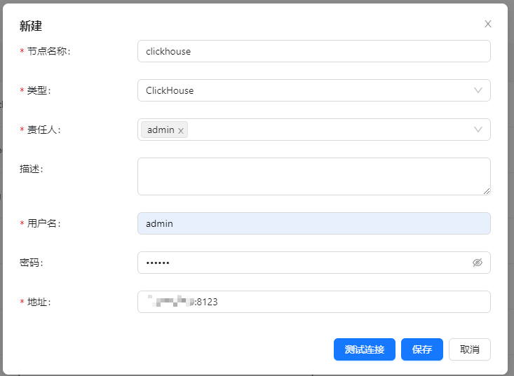
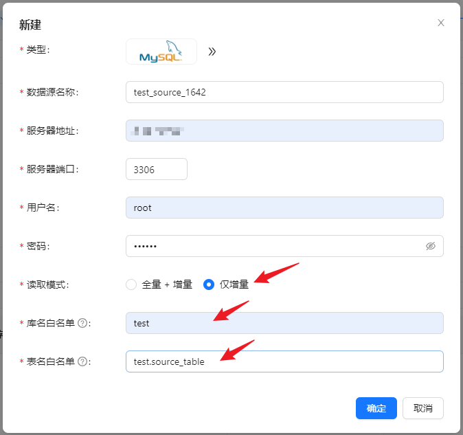

在下面的内容中，我们将通过一个完整的示例介绍如何使用 Apache InLong 创建 MySQL -> ClickHouse 数据同步。

## 资源准备

- 下载最新发布的 [Apache InLong 1.9.0 安装包](https://downloads.apache.org/inlong/1.9.0/apache-inlong-1.9.0-bin.tar.gz)
- 准备 Docker、Docker Compose 环境

## 环境部署
### 安装 Apache InLong

解压 apache-inlong-1.9.0-bin.tar.gz

``` shell
# 进入安装目录
cd docker/docker-compose
# 启动
docker-compose up -d
```

### 安装 ClickHouse
```shell
docker run -d --rm --net=host --name clickhouse -e CLICKHOUSE_USER=admin -e CLICKHOUSE_PASSWORD=inlong -e CLICKHOUSE_DEFAULT_ACCESS_MANAGEMENT=1 clickhouse/clickhouse-server:22.8
```

## 集群初始化
当所有容器都成功启动后，可以访问 InLong Dashboard 地址 http://localhost，并使用以下默认账号登录:
```
User: admin
Password: inlong
```
### 创建集群标签
页面点击 【集群管理】→【标签管理】→【新建】


**注意：由于各个组件默认上报集群标签为 default_cluster，请勿使用其它名称。**

### 注册 Pulsar 集群


**可以参考截图信息填写内部，包括集群名称、所属标签、Pulsar 集群地址等。**

### 注册 ClickHouse 数据节点

页面点击 【数据节点】→【新建】，新增 ClickHouse 数据节点：



## 任务创建
### 新建数据流组

页面点击【数据同步】→【新建数据同步】，填写 数据流组 ID 和 SteamID：


### 新建数据源

数据来源中 点击 【新建】→【MySQL】，配置数据源名称、地址、用户密码以及库表（test.source_table）信息等。



注：请预先创建 test.source_table 库表，schema 为： CREATE TABLE test.source_table ( id INT PRIMARY KEY, name VARCHAR(50) );

### 新建数据目标

数据目标中 点击 【新建】→【ClickHouse】，配置名称、库表、已创建的 ck 数据节点。数据同步不支持自动创建数据目标表，所以需要手动创建。


### 配置字段信息

分别在 【源字段】 和 【目标字段】中配置 Schema 映射信息，完成后点击 【提交审批】


### 审批数据流

页面点击【审批管理】->【我的审批】->【详情】->【通过】


返回 【数据同步】页面，等待任务配置成功

## 测试数据
### 发送数据

```shell
#!/bin/bash

# MySQL数据库连接信息
DB_HOST="mysql"
DB_USER="root"
DB_PASS="inlong"
DB_NAME="test"
DB_TABLE="source_table"

# 循环插入数据
for ((i=1; i<=1000; i++))
do
# 生成要插入的数据
id=$i
name="name_$i"

    # 构建插入语句
    query="INSERT INTO $DB_TABLE (id, name) VALUES ($id, '$name');"

    # 执行插入语句
    mysql -h $DB_HOST -u $DB_USER -p$DB_PASS $DB_NAME -e "$query"
done
```

累计插入 1000 条数据：


### 数据验证

然后进入 ClickHouse 容器，查看库表数据：


也可以在页面查看审计数据：


## 常见问题
Clinkhouse 写入数据失败，可以在 Flink 页面查看报错，并检查所使用的用户的权限以及表引擎