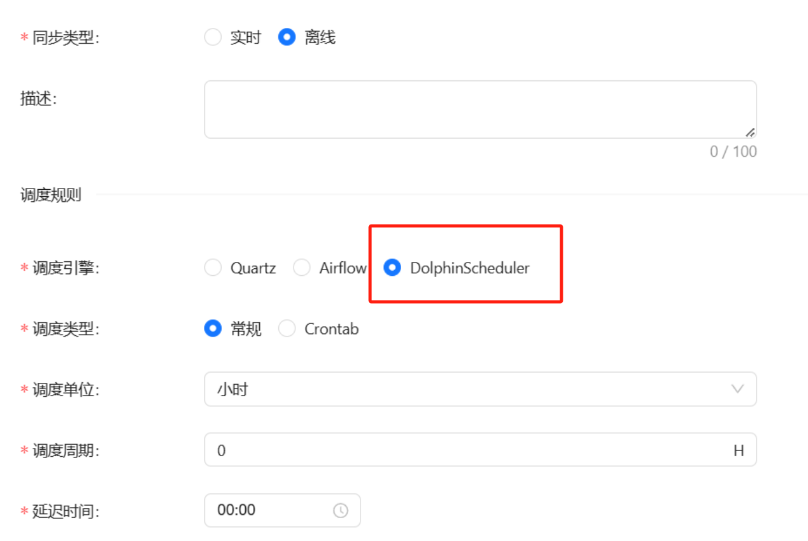
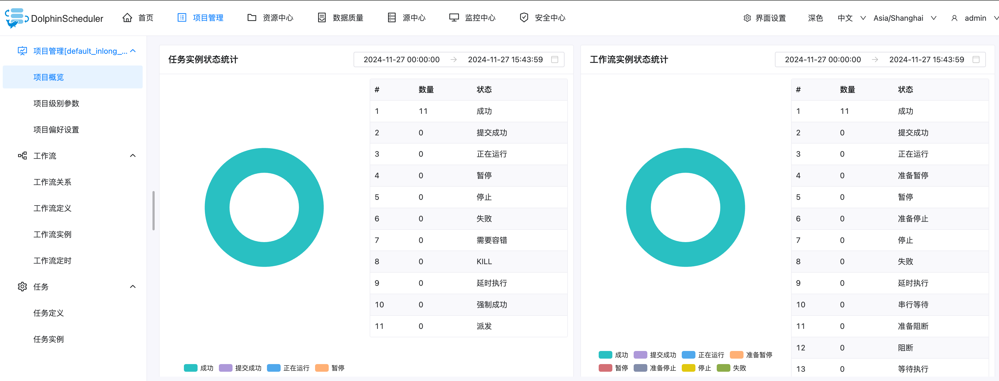

在接下来的内容中，我们将介绍如何在 Apache InLong 中集成第三方调度引擎 DolphinScheduler 来创建离线数据同步。

## ## 环境部署

### 安装 InLong

在开始之前，我们需要安装 InLong 的全部组件，这里提供两种方式：

- [Docker 部署](deployment/docker.md)（推荐）
- [Bare Metal 部署](deployment/bare_metal.md)

### 添加 Connectors

下载与 Flink 版本对应的 [connectors](https://inlong.apache.org/zh-CN/downloads)，解压后将 `sort-connector-jdbc-[version]-SNAPSHOT.jar` 放在 `/inlong-sort/connectors/` 目录下。
> 当前 Apache InLong 的离线数据同步能力只支持 Flink-1.18 版本，所以请下载 1.18 版本的 connectors。

### 在 DolphinScheduler 上的操作

在使用 DolphinScheduler 作为调度引擎之前，请确保手头有正常可用的 DolphinScheduler。如果您需要为自己部署一个 DolphinScheduler，请参考 [DolphinScheduler 官方文档](https://dolphinscheduler.apache.org/zh-cn)。


进入令牌管理器页面创建一个令牌供 InLong 进行访问


按照图中步骤设置 token 参数，包括 [过期时间]、[用户]，并生成令牌。


### 修改 InLong Manager 中的配置

对于第三方调度引擎，我们需要在 InLong Manager 中修改配置

对于 DolphinScheduler 引擎，需要修改以下配置：

* `schedule.engine.inlong.manager.url` : 第三方调度引擎需要通过该 url 访问 InLong Manager。
* `schedule.engine.dolphinscheduler.url` : DolphinScheduler 部署的 url，一般格式为 http://{ip}:{port}/dolphinScheduler
* `schedule.engine.dolphinscheduler.token` : 上文中在 DolphinScheduler 令牌管理器页面中生成的 Token。


完成这些操作后，重新启动 InLong Manager 以确保配置成功启用。

### 在离线同步任务中使用 DolphinScheduler

在配置离线同步任务时，在选择调度引擎时选择 DolphinScheduler，然后配置其他参数



集群管理和相关数据节点的配置请参见[使用内置的 Quartz 调度引擎](quartz_example.md)。

审批数据流后，返回【数据同步】页面，等待任务配置成功，配置成功后，DolphinScheduler 将定期回调 InLong Manager，并周期提交 Flink Batch Job 到 Flink 集群。





查看 DolphinScheduler 任务实例日志。输出如下日志表示配置成功


## 测试数据

### 发送数据

通过 Pulsar SDK 生产数据写入的 Pulsar topic 中，示例如下：

```java
        // Create Pulsar client and producer
        PulsarClient pulsarClient = PulsarClient.builder().serviceUrl("pulsar://localhost:6650").build();
        Producer<byte[]> producer = pulsarClient.newProducer().topic("public/default/test").create();

        // Send messages
        for (int i = 0; i < 10000; i++) {
            // Field separator is |
            String msgStr = i + "|msg-" + i;
            MessageId msgId = producer.send(msgStr.getBytes(StandardCharsets.UTF_8));
            System.out.println("Send msg : " + msgStr + " with msgId: " + msgId);
        }
```

### 数据验证

然后进入 Mysql，查看库表数据，可以看到数据已经同步到 MySQL 中。


