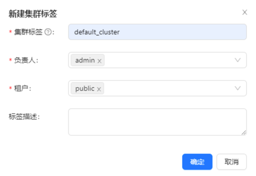
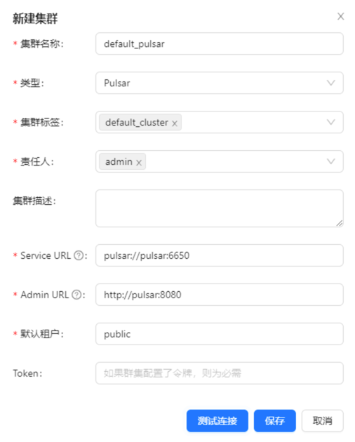
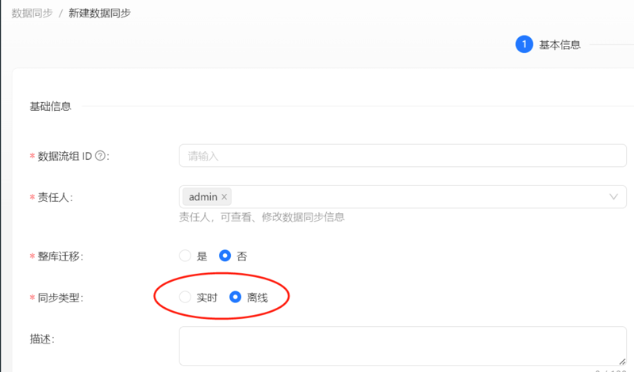
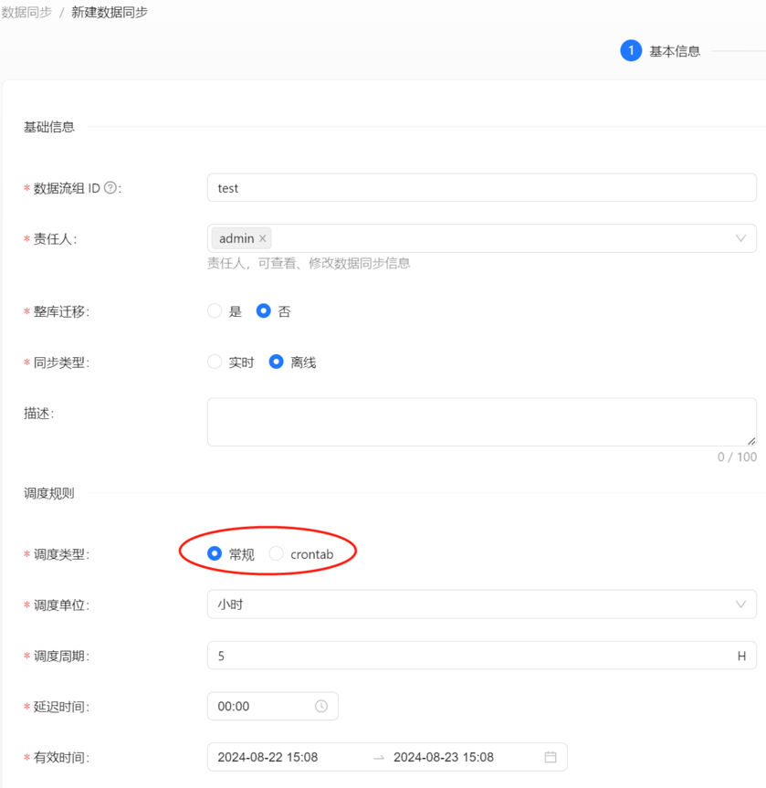
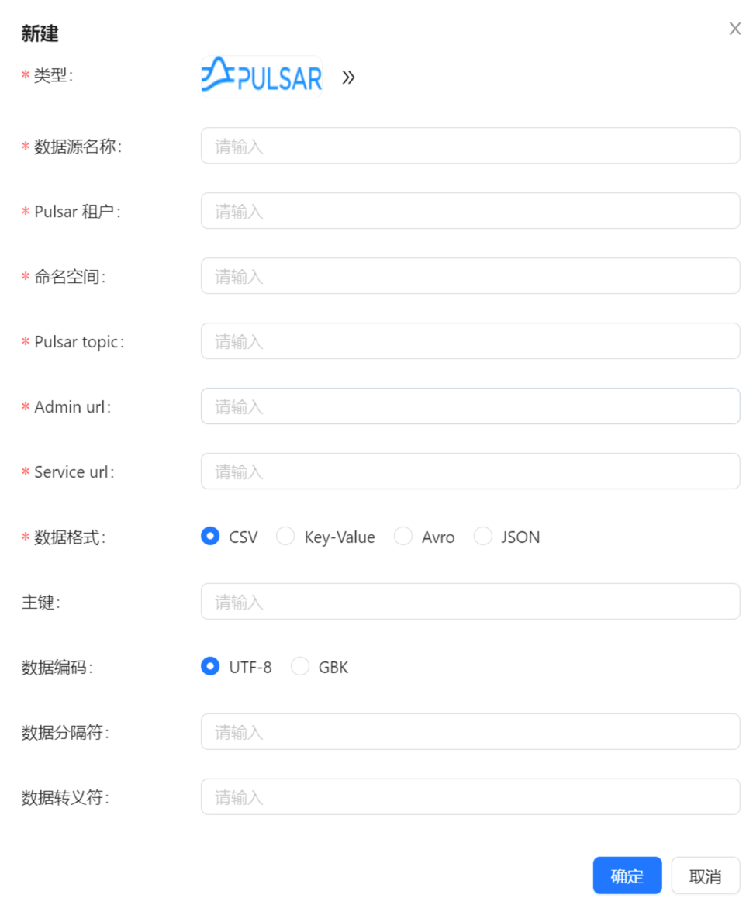
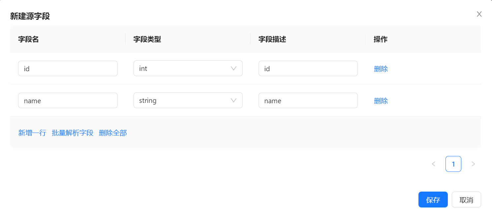
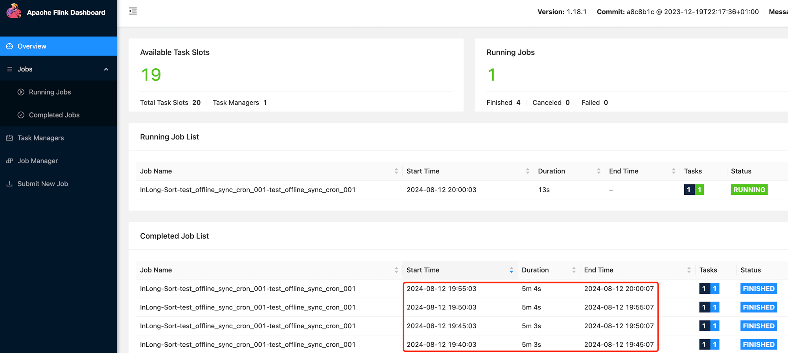
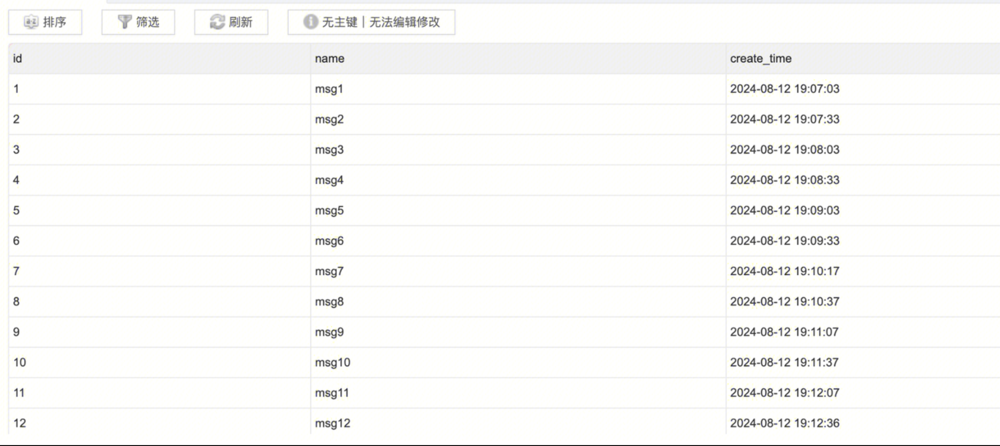

在下面的内容中，我们将通过一个完整的示例介绍如何使用 Apache InLong 内置的调度引擎创建 Pulsar -> MySQL 的离线数据同步。

## 环境部署
### 安装 InLong

在开始之前，我们需要安装 InLong 的全部组件，这里提供两种方式：
- [Docker 部署](deployment/docker.md)（推荐）
- [Bare Metal 部署](deployment/bare_metal.md)

### 添加 Connectors

下载与 Flink 版本对应的 [connectors](https://inlong.apache.org/zh-CN/downloads)，解压后将 `sort-connector-jdbc-[version]-SNAPSHOT.jar` 放在 `/inlong-sort/connectors/` 目录下。
> 当前 Apache InLong 的离线数据同步能力只支持 Flink-1.18 版本，所以请下载 1.18 版本的 connectors。

## 集群初始化
InLong 服务启动后，可以访问 InLong Dashboard 地址 `http://localhost`，并使用以下默认账号登录:
```
User: admin
Password: inlong
```
### 创建集群标签
页面点击 【集群管理】→【标签管理】→【新建】。



**注意：default_cluster 是各个组件默认的集群标签，如果使用其它名称，确认对应标签配置已修改。**

### 注册 Pulsar 集群



**可以参考截图信息填写，包括集群名称、所属标签、Pulsar 集群地址等。**

## 任务创建
### 新建数据流组
页面点击【数据同步】→【新建数据同步】，填写 数据流组 ID，注意同步类型勾选为“离线”。



### 配置调度规则
在同步类型勾选为“离线”之后，就可以配置离线任务的调度规则，调度规则主要由两个部分组成，分别为【调度引擎】和【调度类型】。

#### 调度引擎
Apache InLong 提供了多种调度引擎供用户选择，Quartz 是 Apache InLong 内置的调度引擎，这里使用 Quartz 来处理任务。


#### 调度类型
 Apache InLong 目前支持两种调度类型：常规和 crontab。

常规调度类型配置需要设置以下参数：
- 调度单位：支持分钟、小时、天、月、年以及单次，单次表示只执行一次。
- 调度周期：表示两次任务调度之间的时间间隔。
- 延迟时间：表示任务启动的延迟时间。
- 有效时间：包括起始时间和结束时间，调度任务只会在这个时间范围内执行。



crontab 调度类型需要设置以下参数：
- 有效时间：包括起始时间和结束时间，调度任务只会在这个时间范围内执行。
- crontab 表达式：表示任务的周期，比如 `0 */5 * * * ?`。


### 新建数据源

数据来源中 点击 【新建】→【Pulsar】，配置数据源名称、Pulsar tenant、namespace、topic、admin url、service url、数据格式等参数。



注：Pulsar 的 topic 需要预先在 Pulsar 集群创建（或者在 Pulsar 集群开启自动创建 topic 功能）。

### 新建数据目标

创建目标 MySQL 表，示例 SQL 如下：
```sql
CREATE TABLE sink_table (
    id INT AUTO_INCREMENT PRIMARY KEY,
    name VARCHAR(255) NOT NULL,
    create_time TIMESTAMP DEFAULT CURRENT_TIMESTAMP
);
```

数据目标中 点击 【新建】→【MySQL】，配置数据目标名称、库名和表名（test.sink_table）等信息。


### 配置字段信息

分别在 【源字段】 和 【目标字段】中配置 Schema 映射信息，完成后点击 【提交审批】。




### 审批数据流

页面点击【审批管理】->【我的审批】->【详情】->【通过】。


返回 【数据同步】页面，等待任务配置成功，配置成功后，Manager 会周期提交 Flink Batch Job 到 Flink 集群。



## 测试数据
### 发送数据

通过 Pulsar SDK 生产数据写入的 Pulsar topic 中，示例如下：
```java
        // 创建 pulsar client 和 producer
        PulsarClient pulsarClient = PulsarClient.builder().serviceUrl("pulsar://localhost:6650").build();
        Producer<byte[]> producer = pulsarClient.newProducer().topic("public/default/test").create();

        // 发送消息
        for (int i = 0; i < 10000; i++) {
            // 字段分隔符为 |
            String msgStr = i + "|msg-" + i;
            MessageId msgId = producer.send(msgStr.getBytes(StandardCharsets.UTF_8));
            System.out.println("Send msg : " + msgStr + " with msgId: " + msgId);
        }
```

### 数据验证

然后进入 Mysql，查看库表数据，可以看到数据已经同步到 MySQL 中。


